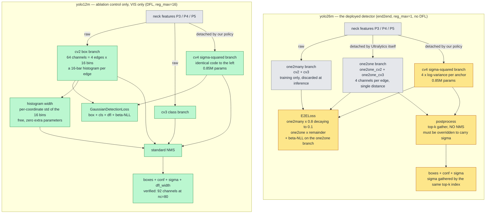
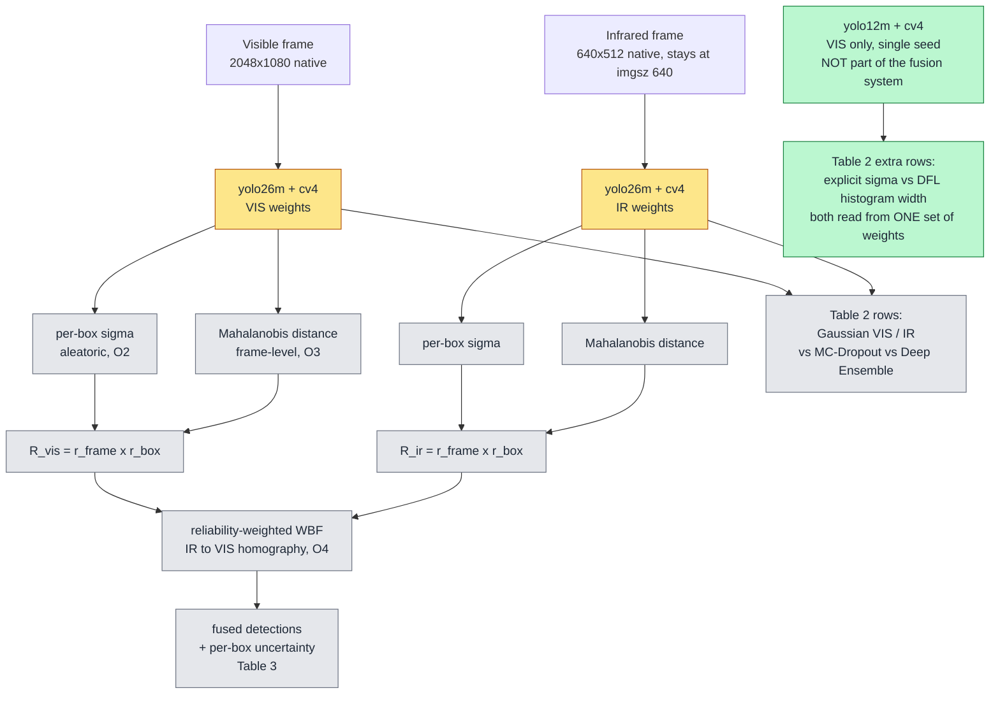

# Option A architecture — `yolo26m` deployed, `yolo12m` as the §7.2 ablation control

Status: **§7.2 decision still open.** The code supports *both* options — the end2end port
is required either way. Option A is the only one that additionally trains `yolo12m`.

Colour key (both diagrams): **green** = implemented and gated on this machine; **amber** =
implemented, training run not yet done (GPU work); **grey** = stock Ultralytics, untouched.

---

## 1. Head anatomy — the only place the two models differ

The whole §7.2 question is the single node **`histogram width`**: it exists on the right
because `yolo12m` predicts a 16-bar histogram per box edge, and cannot exist on the left
because `yolo26m` predicts one number per edge. Nothing else about the two heads differs —
`cv4` is identical code in both.

---

## 2. Full system — and which model feeds which table

`yolo12m` is a **dead-end branch**: two Table 2 rows and nothing else. Never fused, never
in Table 3, weights ship with no part of the system. Deleting it removes exactly two rows.

---

## 3. What Option A costs over Option B

| | Option B | Option A |
|---|---|---|
| Models trained | `26m` VIS + `26m` IR | + `12m` VIS |
| GPU cost | — | +1 run, ~40–45 h at imgsz 1280 |
| Code kept alive | end2end path only | end2end path **and** the plain-`Detect` path |
| Table 2 | Gaussian / MC / Ensemble | + explicit-vs-DFL pair |
| Risk added | — | none to the deployed system; `12m` path already verified |

`yolo12m` is the right control because it is compute-matched to `yolo26m`, leaving head
design as the only variable:

| | params | GFLOPs | FPS fp32 | Phase 1 mAP50-95 |
|---|---|---|---|---|
| `yolo26m` | 21.9 M | 75.4 | 56.4 | 0.3016 ± 0.0050 |
| `yolo12m` | 20.2 M | 68.1 | 56.1 | 0.2906 ± 0.0046 |

**The claim this buys, stated honestly:** the ablation answers "is the free DFL signal as
good as an explicit variance branch?" *on a DFL backbone*. It does not compare across the
two backbones — that comparison is confounded by the backbone and must not be made.
