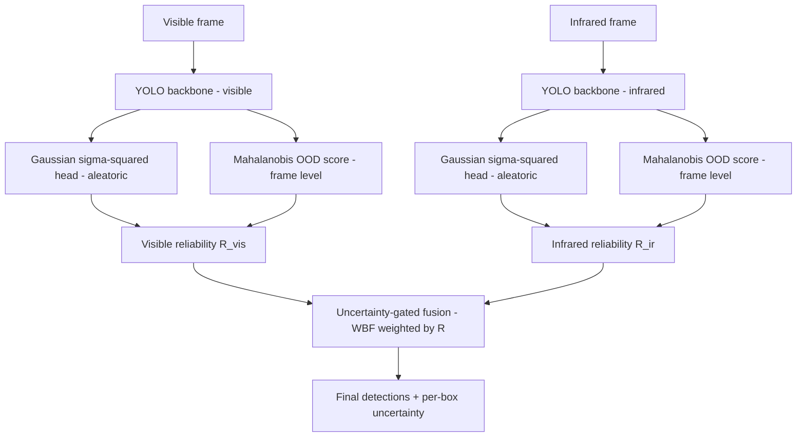

# Project Scope: Uncertainty-Aware Fusion of Visible and Infrared Imagery for Reliable Maritime Object Detection

**Student:** Laksh Saroha (Roll No. 1024060068), ECED
**Faculty Mentor:** Dr. Sandeep Mandia, Assistant Professor, ECED
**Institution:** Thapar Institute of Engineering and Technology, Patiala
**Programme:** UG Research Fellowship
**Version:** Consolidated scope (merges the revised Project Scope, Technology Stack & Implementation Plan, Architecture Review, Annotation Strategy, and Chat Summary into a single document)

---

## 1. One-Paragraph Summary

This project develops a maritime object detector that not only localizes vessels but also estimates, in a single forward pass, *how much its own prediction can be trusted at that moment*. This self-assessed reliability is *intended* to decide, frame by frame, how much to rely on the visible (RGB) camera versus the thermal (infrared) camera — automatically down-weighting whichever sensor is degraded by fog, glare, darkness, or thermal crossover. The core contribution is a **controlled maritime uncertainty study**: a calibrated, single-pass uncertainty signal, evaluated on its own terms, together with a pre-registered test of whether it improves visible–infrared sensor fusion — reported whether the answer is yes or no.

Prior work has already applied uncertainty to visible–infrared fusion (R24 UA-CMDet 2022; R25 DICTA 2024) and to single-pass localization variance (R1 Gaussian YOLOv3 2019). The contribution here is not the idea but the measurement: declared metric contracts, a measured noise floor, dependence-aware intervals, and negative results published rather than retried.

**Status as measured, 2026-09-10 (R-D1, [`docs/uq-mechanism-2026-09-10.md`](docs/uq-mechanism-2026-09-10.md)):** under the shipped `crossmodal` preset the fusion weight is a **single constant 0.9930** across all 2,232 paired frames × 4 conditions, and supplying real predicted uncertainty does not beat the same uncertainties attached to the wrong boxes at any floor tested. The gain that is real comes from **image-statistic sensor selection**, not from uncertainty-weighted blending. The paragraph above states the aim; this note states what has been measured, and the two are not yet the same thing. Positioning and the full comparison: [`docs/positioning-2026-09-10.md`](docs/positioning-2026-09-10.md).

> *Superseded wording (kept for audit):* “Unlike most prior maritime fusion work, which blends sensors on a fixed schedule, this system blends them based on live, per-frame uncertainty.”

---

## 2. Motivation and Research Gap

Electro-Optical (EO) sensors (visible + infrared) supplement marine radar but each modality fails silently under specific conditions: visible cameras degrade in fog, haze, glare, rain, and darkness; infrared cameras see through glare and darkness but fail during *thermal crossover*, when vessel and water reach the same temperature. The safety risk is not occasional error but *confident* error, with no signal that the sensor has become unreliable.

Two gaps from the literature:

1. **Most maritime detectors output no uncertainty at all** (SID-YOLOv5, EG-YOLO, RDSC-YOLOv4, YOLOv7-sea, feature-fusion nets). Single-pass localization variance is established outside maritime work (R1 Gaussian YOLOv3, autonomous driving), and uncertainty-aware cross-modal detection is established outside maritime work too (R24, R25) — so neither the head nor the idea of conditioning fusion on uncertainty is claimed as new here. What is thin is the maritime evidence: whether these uncertainties are *calibrated* on paired VIS+LWIR maritime video, and whether they buy anything once measured against a stated noise floor.
2. **Calibrated evaluation of uncertainty-conditioned fusion is scarce.** Uncertainty-conditioned visible–infrared fusion exists (R24 UA-CMDet 2022 pairs uncertainty-aware cross-modal learning with illumination-aware NMS *at inference*; R25 DICTA 2024), and learned attention is not “static” merely because its parameters are frozen — attention values depend on the input. The open question is not whether fusion can be conditioned on uncertainty but whether the uncertainty doing the conditioning is itself trustworthy, measured against a stated noise floor with dependence-aware intervals, and reported when the answer is no.

This project sits in that gap: a controlled maritime study of whether single-pass UQ is calibrated and whether it improves visible–infrared fusion, with calibration treated as a first-class result and null results treated as results.

> *Superseded wording (kept for audit):* “Existing visible–infrared fusion is static — fixed rules or learned-but-static attention, never conditioned on a live per-frame reliability estimate.” Retired 2026-09-10 as factually wrong; see [`docs/positioning-2026-09-10.md`](docs/positioning-2026-09-10.md).

---

## 3. Aim and Objectives

**Aim:** Design, implement, and rigorously validate a calibrated single-pass UQ method for maritime detection, and use that uncertainty to adaptively fuse visible and infrared imagery for improved reliability under adverse conditions.

- **O1 — Baseline.** Establish a deterministic detection baseline on maritime data by selecting a YOLO model backbone.
- **O2 — Aleatoric UQ (core contribution).** Single-pass probabilistic head predicting a predictive variance per box coordinate, trained with NLL → per-detection aleatoric uncertainty at real-time speed.
- **O3 — Distributional/epistemic UQ.** Low-cost frame-level estimator (feature-space distance to the training distribution) catching total-sensor-degradation that per-detection uncertainty misses.
- **O4 — Uncertainty-gated fusion.** Per-modality reliability score from O2 + O3, used to adaptively fuse the two streams so the more reliable modality dominates instant-by-instant.
- **O5 — Validation.** Evaluate *calibration* (does predicted uncertainty track real error?) and **test**, under a rule fixed in advance, whether uncertainty-gated fusion beats single-modality and uncertainty-blind fusion under adverse conditions — reporting the outcome either way.
  - *Half met, half answered NO.* Gated fusion sits at or above max(VIS, IR) on all eight benchmark cells. But against **uncertainty-blind** fusion, R-D1 (2026-09-10) is a pre-registered NULL at every floor: 0 of 4 conditions. The original wording promised a result the project has since contradicted, so it now names the test, not the verdict.

---

## 4. Scope Boundaries

**In scope:** simulation-based research on public datasets + synthetic augmentation; a single YOLO backbone used as-is except for the variance output branch; aleatoric UQ via a Gaussian head; distributional UQ via Mahalanobis OOD; uncertainty-gated soft fusion; comparison against MC-Dropout and Deep Ensembles; full calibration analysis; optional conformal extension.

**Out of scope (explicit):** accuracy-oriented architecture changes (no P2/small-object head, no SPD-Conv, no attention modules, no backbone redesign) — the detector is held fixed so measured effects are attributable to the UQ method, not a stronger detector; embedded deployment (speed is *reported*, not deployed); new data collection; non-EO sensors (radar/LiDAR/AIS); 3D detection, tracking, re-ID.

---

## 5. Datasets

### 5.1 Primary Datasets (Paired VIS + IR)

These are the two primary datasets used for training and evaluating the uncertainty-gated fusion system. Both provide co-registered visible and infrared imagery with detection-level annotations.

| Role | Dataset | Description | Key Stats |
| --- | --- | --- | --- |
| **Paired VIS+LWIR fusion testbed** | **Pohang Canal Dataset + PoLaRIS annotations** | Multimodal maritime dataset on a 7.5 km route in the Pohang canal / inner-outer port / near-coastal region (Chung et al., IJRR 2023, KAIST MORIN lab). Stereo visible (2048×1080, 10 Hz) and thermal infrared (640×512, 16-bit, 10 Hz). PoLaRIS provides YOLO-format bounding-box annotations (2 classes: ship, buoy). 5 runs (pohang00–04), with pohang01 being a night run. License: CC BY-NC 4.0. | ~158k images, ~1.22M boxes; ~28k paired VIS↔IR frames with labels in both modalities; VIS: 127k images / IR: 31k images |
| **Multi-sensor maritime perception** | **MIT Sea Grant AUV Lab Marine Perception Dataset** | Multi-sensor marine perception dataset collected on R/V Philos on the Charles River, Cambridge, MA (MIT Sea Grant). Contains visible video (left/center/right cameras, 12 fps), infrared (left/right, 30 fps), lidar, and radar. Multiple scenarios including close approaches, sailboat crossings, and in-place turns. License: CC BY-NC-SA 4.0. We have manually annotated a subset of images from this dataset ourselves. | Multiple runs across different dates and conditions (2020–2021+); paired VIS+IR with varying weather/lighting; scenarios include busy traffic, crossing vessels, and maneuvering |

**Pohang Canal dataset details:**

- Runs: pohang00 (day, dense both modalities), pohang01 (night), pohang02–04 (varying IR coverage)
- pohang04 has **zero IR labels** — VIS-only contribution
- pohang03 IR is sparse (~1,922 vs ~13k VIS)
- VIS↔IR pairing by nearest-neighbor timestamp within 50 ms (sensors not on same hardware trigger)
- No spatial registration between VIS and IR — decision-level fusion (WBF on boxes) tolerates this
- Data tree organized as per-modality YOLO format with separate `data_vis.yaml` and `data_ir.yaml`

**MIT Marine Perception dataset details:**

- Provides paired visible + infrared data suitable for fusion experiments
- Contains multiple encounter scenarios with varying vessel types and densities
- Raw sensor data requires annotation processing for YOLO-format detection labels

### 5.2 Adverse-Condition Generation

| Source | Method |
| --- | --- |
| **Synthetic augmentation** | Albumentations (RandomFog, RandomSunFlare, RandomRain, MotionBlur, GaussNoise, ISONoise) — manufactures the high-uncertainty test conditions on which robustness is tested |
| **Synthetic thermal crossover** | Blending vessel IR pixels toward background mean temperature (see Section 10) |

### 5.3 Additional Datasets That Can Be Used

These are publicly available maritime datasets that could supplement the primary datasets if needed for pretraining, additional evaluation, or domain-specific testing.

| Dataset | Description | Potential Role |
| --- | --- | --- |
| **Singapore Maritime Dataset (SMD)** | Both EO and IR videos, ~240k object labels, 10 classes, bounding boxes. Separate annotations for EO and IR streams (Prasad et al., IEEE T-ITS, 2017). | Multi-modal detection benchmark; supplementary fusion evaluation on a geographically different dataset |
| **MassMIND** (Massachusetts Maritime INfrared Dataset) | ~2,900 LWIR images; segmentation labels convertible to bounding boxes via OpenCV; 7 classes (Nirgudkar et al., IJRR, 2023). | Dedicated IR-only test bed; includes thermal-crossover regime; independent evaluation of IR branch calibration |

---

## 6. Architecture and Working of the Model

### 6.1 Pipeline (inference, one synchronized frame pair)

Each modality runs its own YOLO model (visible and IR are different image domains → separate weights). From each backbone, two signals are tapped in the same forward pass: the Gaussian σ² head (per-box aleatoric uncertainty) and the Mahalanobis frame-level OOD score. These collapse into one reliability number `R_m` per modality (multiplicative — either failure mode can condemn a stream). The two `R` values weight Weighted Boxes Fusion (WBF): fog/glare drives `R_vis` down and the output leans on IR; thermal crossover does the reverse. Everything is single-pass, preserving real-time operation.



### 6.2 Aleatoric Head and NLL Loss (O2)

The head predicts mean μ and variance σ² for each coordinate `t ∈ {x, y, w, h}`. Base Gaussian NLL box loss:

$$L_{\text{loc}} = \sum_{t} \left[ \frac{(t_{\text{gt}} - \mu_t)^2}{2\sigma_t^2} + \frac{1}{2} \log(\sigma_t^2) \right]$$

The first term is error scaled down where the model is (correctly) uncertain; the second prevents trivial variance inflation. Per-detection uncertainty is summarized as the mean predicted variance across the four coordinates (in practice, size-normalized — see 6.4).

**Pre-empting the heteroscedastic-NLL failure mode (highest priority).** Vanilla NLL tends to "explain away" hard examples — inflating σ² on difficult boxes to shrink the loss instead of improving μ — which degrades localization *and* miscalibrates the uncertainty [Seitzer 2022; Skafte 2019]. Fix cheaply with **β-NLL** (weight each sample's NLL by a stop-gradient factor `σ^{2β}`, β∈[0,1]) and/or a **warm-up** where μ trains under a normal box loss first, then σ² is unfrozen. The tiny-subset test harness should specifically verify σ² is *not* just ballooning on hard samples.

### 6.3 Frame-Level Distributional/OOD Score (O3)

A fully degraded frame (blank fog) can yield few/no detections, which naively looks like *low* uncertainty. To catch this, backbone features are extracted via a forward hook and their Mahalanobis distance to the training-feature distribution is computed; large distance = out-of-distribution = unreliable frame. Cheap, single-pass, sampling-free, no architecture change. The two signals are complementary: **box-level aleatoric** catches ambiguous-but-present objects; **frame-level distributional** catches the sensor giving up entirely.

### 6.4 Reliability Score and Fusion (O4)

Per frame, per modality *m*:

- Per-detection uncertainty, size-normalized and confidence-weighted:
  - $u_i = \frac{1}{4} \sum_t \frac{\sigma_{i,t}}{s_{i,t}}$, where $s$ = box width/height.
  - $U_{\text{box},m} = \frac{\sum_i c_i u_i}{\sum_i c_i}$, where $c_i$ = objectness confidence.
- Frame-level, calibrated to [0,1] on a clean validation set:
  - $O_m = \sigma\left(\frac{d_m - \mu_d}{\tau}\right)$, where $d_m$ = Mahalanobis distance.
- Combine multiplicatively:
  - $r_{\text{box},m} = \exp(-\lambda \cdot U_{\text{box},m})$, $r_{\text{frame},m} = 1 - O_m$, $R_m = r_{\text{frame},m} \cdot r_{\text{box},m}$.
- **Empty-frame case:** if no detections, fall back to $R_m = r_{\text{frame},m}$ (distinguishes clear-empty-sea = reliable from fog-blind = unreliable).
- **Temporal smoothing (video):** $\bar{R}_m(t) = \alpha R_m(t) + (1-\alpha) \bar{R}_m(t-1)$.
- **Fusion weights:** $w_m = \bar{R}_m / (\bar{R}_{\text{visible}} + \bar{R}_{\text{infrared}})$, fed into WBF.

**Critical caveat:** every constant (λ, sigmoid μ_d/τ, α, the multiplicative form) is a **tunable design choice to be validated empirically** via ablation + calibration curves — not a settled formula. Both signals are only meaningful **after calibration on held-out data**; combining raw signals lets the larger numeric range dominate.

---

## 7. Architecture Review — Refinements and Open Decisions

The spine (single-pass aleatoric + frame-level OOD → soft fusion) is sound and publishable as-is. Five refinements harden it against review.

**7.1 Pre-empt the heteroscedastic-NLL failure mode (highest priority).** Vanilla NLL tends to "explain away" hard examples. Fix with **β-NLL** and/or **warm-up** (see Section 6.2).

**7.2 DFL-derived vs explicit Gaussian σ².** Some YOLO variants retain the distributional regression head (DFL); GFLv2 showed the *shape* of that distribution is itself a usable localization-quality/uncertainty signal — effectively free, no architecture change [Li 2021]. Three options: (a) derive uncertainty from the existing DFL distribution; (b) replace DFL with explicit Gaussian; (c) add a Gaussian branch on top. A one-paragraph justification — ideally a small ablation "DFL-derived vs explicit Gaussian σ²" — turns a likely reviewer question into a contribution. *(This decision depends on which YOLO backbone is selected.)*

**7.3 Cite (and possibly benchmark) evidential regression.** Deep Evidential Regression is single-pass like the Gaussian head but returns aleatoric *and* epistemic uncertainty in one pass [Amini 2020]. It has real criticism (its epistemic term is contested) [Meinert 2023], so this is a citation/baseline, not a switch.

**7.4 The independence assumption can fail under correlated degradation.** Heavy rain / sea spray / some low-light conditions degrade EO *and* IR together. The multiplicative per-modality `R` with independent OOD scores handles "one sensor blind" well but can be overconfident when both degrade. Add an explicit caveat and a "both-degraded" row in the robustness table.

**7.5 Add a learned gate as an upper-bound comparison (not a replacement).** A tiny learned gating network on the same uncertainty features gives a performance ceiling: if the interpretable score matches it, that's a result *for* the method; if it lags, it shows where hand-tuning leaks performance.

---

## 8. Detector Choice: YOLO Model Backbone

**The backbone will be selected based on empirical evaluation.** The YOLO family is chosen for three reasons: (1) real-time single-stage design; (2) mature Ultralytics tooling that makes multi-seed benchmarking and custom-head forks feasible; (3) some YOLO variants have distributional regression heads (DFL), which pair naturally with the variance approach. The UQ method itself is largely **detector-agnostic** (variance head + Mahalanobis + WBF fusion can sit on any dense detector), so YOLO is a sensible default rather than a lock-in.

**Backbone selection method (TBD).** The specific YOLO variant will be selected based on its suitability as a base for the variance-modeling approach, considering:
- Presence of a distributional regression head (DFL) for natural pairing with variance modeling
- Balanced performance (mAP, FPS, params) on maritime data
- Ease of modifying the head/loss for the Gaussian uncertainty extension
- Each variant run over **≥3 random seeds** and reported as mean ± standard deviation

**The one alternative genuinely worth a benchmark row: a real-time DETR variant.** NMS-free DETR-family detectors (RT-DETR, D-FINE, etc.) now match or beat YOLO on the accuracy–latency curve while being end-to-end (no NMS). Two reasons this matters for UQ: (1) NMS-free = cleaner uncertainty semantics (NMS discards boxes and can distort objectness confidence), and (2) D-FINE is distribution-native. **Trade-off:** heavier to modify, less community tooling, longer training. **Recommendation:** keep YOLO as primary; optionally add one NMS-free DETR as an extra benchmark row to evidence the "detector-agnostic" claim.

---

## 9. Experimental Design — Two Separate Comparisons

This distinction is critical; conflating the two comparisons is a common error.

### 9.1 Comparison 1 — Detector Benchmark (O1, backbone selection)

Select the best YOLO backbone for the UQ work. Each variant run with **identical** configuration (same split, image size, epochs, optimizer, augmentation, hardware), over **≥3 seeds**, reported as mean ± std. This comparison involves **no uncertainty**; its sole purpose is to select the backbone and produce the deterministic baseline table. *(Optionally +1 NMS-free DETR row.)*

### 9.2 Comparison 2 — Uncertainty-Source Comparison (core UQ result)

Gaussian head vs MC-Dropout vs Deep Ensemble are **alternative ways to produce the uncertainty signal on the same selected YOLO backbone** — *not* rival pipelines to the fusion system. Claim: the Gaussian head matches ensemble/MC-Dropout calibration at a fraction of the compute. Ensemble = the gold standard to match cheaply, not to beat.

### 9.3 Fusion System's Own Baselines

Visible-only, IR-only, naive (uncertainty-blind) fusion.

### 9.4 Per-Modality Model Grid

Visible (RGB) and infrared are different domains with different training data → every uncertainty method is built **twice — once per modality**:

| Method | Visible | IR | Total models |
| --- | --- | --- | --- |
| Gaussian head | 1 | 1 | **2** |
| MC-Dropout | 1 (×T passes) | 1 (×T passes) | 2 |
| Deep Ensemble (M=5) | 5 | 5 | **10** |

Cost column (2 vs 10) is itself a result.

### 9.5 Result Tables for the Manuscript

**Table 1 — Detector benchmark (backbone selection).**

| Model | Precision | Recall | mAP@50 | mAP@50–95 | FPS | Params | (mean ± std, 3 seeds) |
| --- | --- | --- | --- | --- | --- | --- | --- |

**Table 2 — Per-modality uncertainty calibration (core UQ result).**

| UQ source | Modality | ECE ↓ | NLL ↓ | Sparsification error ↓ | AURC ↓ | Inference cost (×) | # models |
| --- | --- | --- | --- | --- | --- | --- | --- |
| Gaussian head | Visible | | | | | 1× | 1 |
| Gaussian head | Infrared | | | | | 1× | 1 |
| MC-Dropout | Visible | | | | | *T*× | 1 |
| MC-Dropout | Infrared | | | | | *T*× | 1 |
| Deep Ensemble | Visible | | | | | *M*× | 5 |
| Deep Ensemble | Infrared | | | | | *M*× | 5 |

**Table 3 — Fusion robustness under adverse conditions (headline result).**

| System | Clean | Fog | Glare | Low-light | Thermal crossover | Both degraded |
| --- | --- | --- | --- | --- | --- | --- |
| Visible-only | | | | | | |
| Infrared-only | | | | | | |
| Naive fusion (fixed weights) | | | | | | |
| Uncertainty-gated fusion (proposed) | | | | | | |

*(Cells report mAP@50–95. The proposed row is expected to degrade least as conditions worsen.)*

---

## 10. Annotation Strategy for Multimodal Data

### 10.1 The Core Problem with Naively Copying Annotations

When training the Gaussian head with an NLL objective, the model learns (μ, σ) per bounding-box coordinate. If an RGB annotation is copied to an IR frame where the vessel is invisible (e.g., thermal crossover), the model is forced to minimise NLL for a region with no visual evidence. The result: μ drifts with no visual anchor, σ inflates chaotically, and the fusion gate receives no ground truth for the cases it most needs to learn.

### 10.2 The Four Modality Visibility Scenarios

**Scenario 1 — Clear conditions (both modalities).** Copy is safe — bboxes are nearly identical. Both branches should predict low uncertainty; this is the calibration baseline.

**Scenario 2 — Thermal crossover (RGB only).** Vessel visible in RGB, invisible in IR (no thermal contrast at dawn/dusk). **Do not copy RGB annotation to IR.** These frames are gold calibration data — the IR branch should output high σ here.

**Scenario 3 — Fog / darkness / glare (IR only).** Vessel obscured in RGB, visible in IR. **Do not copy IR annotation to RGB.** Critical fusion gate training data — RGB should output high σ; the gate should learn to transfer weight to IR.

**Scenario 4 — Thermal bloom (both visible, different bbox sizes).** Vessel engines radiate heat beyond the hull boundary; IR thermal extent is 10–30% larger than the hull. **Do not copy RGB bbox to IR directly.** Re-annotate IR to the full thermal extent, or apply a dataset-level expansion factor.

**Key principle:** Frames where one modality fails are not annotation problems to clean away — they are the **primary calibration and fusion training signal**.

### 10.3 Automatic Mismatch Detection

Before training, compute a per-annotation **visibility score** for each modality:

```
visibility_score = |mean(pixels_inside_bbox) - mean(pixels_in_background_margin)| 
                   / std(pixels_in_background_margin)
```

If a vessel annotation in IR has near-zero contrast, flag it as a thermal crossover candidate — remove it from the IR training stream or assign a loss weight close to zero. These flagged frames automatically become the calibration test set for O5.

### 10.4 Thermal Crossover Detection

Multiple approaches, in increasing sophistication:

1. **Local contrast (Weber/Michelson):** Per-annotation contrast between vessel region and surrounding background in IR. During crossover, contrast → 0.
2. **Frame-level histogram analysis:** Crossover → thermally uniform frame → histogram entropy drops, bimodal structure collapses.
3. **Edge response at bbox boundary:** Sobel/Canny gradient magnitude along bbox perimeter; weak edges = crossover.
4. **Mahalanobis OOD score (from the pipeline):** The frame-level OOD estimator (O3) **naturally flags crossover frames as OOD** — the same signal that drives the fusion gate also serves as a crossover indicator. Most principled approach.

### 10.5 Synthetic Augmentation — Annotation Handling

**Fog/darkness on RGB:** When applying synthetic fog or darkness, remove the visible annotation for obscured objects. The (foggy-RGB, no-annotation) + (clean-IR, with-annotation) pair becomes a correct Scenario 3 training example.

**IR annotations are always retained** under RGB augmentation (fog, rain, darkness, glare do not affect thermal radiation — physical fact).

**Synthetic thermal crossover (IR annotation removal):**

```python
alpha = crossover_severity  # 0.0 = no crossover, 1.0 = full crossover
background_mean = mean(ir_frame[background_margin])
ir_frame[vessel_roi] = (1 - alpha) * ir_frame[vessel_roi] + alpha * background_mean
# Add realistic thermal noise; if alpha > threshold, remove IR annotation
```

---

## 11. Technology Stack

### 11.1 Foundation

Python 3.10+; PyTorch 2.x + CUDA; conda/venv + pinned `requirements.txt`; Git (+ GitHub) tracking *which commit produced which result*; global seed control (`torch`, `numpy`, `random`), determinism where feasible; single GPU (free Colab/Kaggle for fine-tuning, institutional GPU for full training), AMP mixed precision.

### 11.2 Detector Framework

- **Ultralytics YOLO** — unified API for training/eval with identical settings across variants; `train()/val()/predict()` with built-in P/R/mAP.
- **Data prep:** all datasets to YOLO `.txt` format (`class cx cy w h`, normalized). Pohang Canal already in YOLO format via PoLaRIS pipeline. MIT dataset may need conversion.
- **Tracking:** Weights & Biases (native Ultralytics integration) or TensorBoard (local).

### 11.3 Uncertainty Quantification

- **B.1 Gaussian variance head (core, hand-written PyTorch).** Fork Ultralytics; edit `ultralytics/nn/modules/head.py` (`Detect` — add variance channels) and `ultralytics/utils/loss.py` (replace/augment box term with Gaussian NLL; use β-NLL/warm-up per Section 6.2). *Hardest single piece — budget several weeks; validate on a tiny subset first.*
- **B.2 UQ baselines.** MC-Dropout (dropout active at inference, T passes) and Deep Ensembles (M seeds), both via Ultralytics mechanics. **Torch-Uncertainty** for Packed-Ensembles + standardized calibration metrics. *Note:* Torch-Uncertainty's training routines target classification/segmentation — use Ultralytics for mechanics, Torch-Uncertainty mainly for metrics.
- **B.3 Frame-level OOD.** **pytorch-ood** (Mahalanobis + Energy/MSP/ODIN); backbone forward hook for features; **scikit-learn** `EmpiricalCovariance`/`LedoitWolf` for stable covariance.
- **B.4 Matching + fusion.** **ensemble-boxes** WBF for both ensemble/MC-Dropout aggregation and reliability-weighted vis/IR fusion; **scipy** `linear_sum_assignment` (Hungarian) for custom per-object matching.
- **B.5 Calibration/eval.** **netcal** (ECE/MCE/ACE, reliability diagrams, temperature scaling / histogram binning / beta calibration); **Torch-Uncertainty** (ECE/NLL/Brier, selective-classification) and **torchmetrics** for cross-checks; **custom Matplotlib/NumPy** for sparsification / accuracy-rejection curves, predicted-σ² vs realized-IoU correlation, and OOD-separation histograms.
- **B.6 Adverse generation.** **Albumentations** (`RandomFog`, `RandomSunFlare`, `RandomRain`, `MotionBlur`, `GaussNoise`, `ISONoise`); keep test-condition set separate from training augmentation to avoid leakage.
- **B.7 Conformal (optional stretch).** **TorchCP** or **MAPIE** to turn the reliability score into a coverage-guaranteed abstain threshold. Caveat: exchangeability assumption is violated by video — acknowledge, don't over-claim.

---

## 12. Evaluation Plan

A UQ project is judged on **calibration, not mAP**. Four parts:

1. **Detection accuracy:** P, R, mAP@50, mAP@50–95 per dataset/modality (confirms the UQ head doesn't degrade detection).
2. **Calibration (central):** reliability diagrams + ECE; predicted-variance vs realized-IoU correlation; **sparsification / accuracy-rejection curves** (steep curve = uncertainty is useful).
3. **OOD separation:** histograms separating clear from foggy/glary/crossover frames.
4. **Downstream robustness (headline):** uncertainty-gated fusion vs visible-only, IR-only, and uncertainty-blind fusion under synthetic degradation (including a "both-degraded" row per Section 7.4).

ECE:

$$\text{ECE} = \sum_m \frac{|B_m|}{n} \cdot |\text{accuracy}(B_m) - \text{confidence}(B_m)|$$

(Predictions binned by confidence; each bin's mean confidence compared to empirical accuracy.)

---

## 13. Integration Risks and Mitigations

| Risk | Why it matters | Mitigation |
| --- | --- | --- |
| Modifying Ultralytics head/loss is non-trivial | The Gaussian head is the core contribution and hardest code | Fork; edit `head.py` + `loss.py`; validate on a tiny subset first; use β-NLL/warm-up (6.2) |
| Torch-Uncertainty is not detection-native | Its routines target classification/segmentation | Ultralytics for ensemble/dropout mechanics; Torch-Uncertainty for metrics |
| MIT dataset needs annotation processing | Raw sensor data may not have detection-ready labels | Extract and convert to YOLO format; QA with FiftyOne |
| Pohang Canal IR coverage varies per run | pohang04 has zero IR labels; pohang03 IR is sparse | Disclose in manuscript; do not hide distribution skew |
| Small datasets → unstable variances | UQ can overfit on little data | Augmentation; report variance across seeds |
| Modality registration imperfect | VIS and IR not on same hardware trigger | Fuse at the decision level (WBF), which tolerates misalignment |
| Correlated degradation of both sensors | Independence assumption breaks (7.4) | Add both-degraded test row; caveat the reliability combination |

---

## 14. Tool → Role → Phase Summary

| Tool | Role | Phase |
| --- | --- | --- |
| PyTorch, CUDA | Core DL framework | A + B |
| Ultralytics YOLO | Train/eval detectors; base for modified head | A + B |
| OpenCV, NumPy, Pandas | Data conversion; masks→boxes | A |
| Roboflow / FiftyOne | Dataset formatting and label QA | A |
| Weights & Biases / TensorBoard | Experiment tracking | A |
| torchmetrics | Independent metric verification (mAP, ECE) | A + B |
| **Custom PyTorch (Gaussian head + NLL / β-NLL)** | **Aleatoric UQ — core contribution** | **B** |
| Torch-Uncertainty | Ensemble/Packed-Ensemble baselines; calibration metrics | B |
| pytorch-ood + scikit-learn | Frame-level Mahalanobis OOD score | B |
| ensemble-boxes (WBF) | Ensemble aggregation + uncertainty-gated fusion | B |
| netcal | ECE, reliability diagrams, recalibration | B |
| Albumentations | Adverse-condition generation (fog/glare/rain) | B |
| Matplotlib/NumPy (custom) | Sparsification curves, correlation plots, histograms | B |
| TorchCP / MAPIE | Conformal prediction (optional) | B |
| Git, conda/venv | Reproducibility and version control | A + B |

---

## 16. Expected Outcomes and Deliverables

1. A **calibrated, uncertainty-aware maritime detection pipeline** (code): YOLO model with a single-pass Gaussian uncertainty head, a frame-level OOD estimator, and an uncertainty-gated visible–infrared fusion module.
2. A **benchmark and calibration study**: deterministic baseline, single-pass UQ vs MC-Dropout and Deep Ensembles, full calibration analysis, and OOD-separation results.
3. A **robustness demonstration** under simulated adverse maritime conditions showing the benefit of uncertainty-gated fusion.
4. A **research manuscript** suitable for submission to a conference or journal in maritime perception / computer vision.

---

## 17. Assumptions and Limitations

- **Data pairing:** visible and infrared streams are treated as observing the same scene; where datasets provide unregistered or separately captured modalities, the fusion is at the decision level, which tolerates imperfect spatial registration.
- **Pohang Canal IR gaps:** pohang04 has zero IR labels, pohang03 is sparse — disclosed and not hidden.
- **MIT dataset annotation status:** may require annotation processing to convert raw sensor data into YOLO-format detection labels.
- **Adverse conditions are simulated:** fog, glare, and rain are introduced synthetically; results establish the method's behavior under controlled degradation rather than field-collected extreme weather.
- **Conformal guarantees:** the optional conformal layer assumes exchangeability, which video streams technically violate; this is acknowledged and discussed rather than assumed away.
- **Real-time claim:** the method is single-pass by design, and inference cost is reported, but no embedded/on-vessel deployment is performed within this scope.

---

## 18. Open Next Steps (Critical Path)

Nothing coded yet. Agreed order:

1. **Select backbone** — evaluate candidate YOLO variants on the Pohang Canal dataset; select based on suitability for variance-modeling approach.
2. **Gaussian variance head + NLL (β-NLL / warm-up) inside Ultralytics** — highest-risk, do first. Needs a **tiny-subset test harness** confirming the head trains, loss decreases, and σ² is non-degenerate before committing GPU time.
3. `compute_reliability()` (implements Section 6.4) + WBF-based uncertainty-gated fusion.
4. Mahalanobis frame-level OOD scorer (backbone feature hook + sklearn covariance).
5. Benchmark harness (shared Ultralytics config + multi-seed loop → mean±std table).
6. Calibration/eval scripts (ECE, reliability diagrams, sparsification).

**Sandbox constraint:** full end-to-end training can't run in the assistant's sandbox (no GPU, multi-GB data, days of training). Code is written here; runs happen on Colab/Kaggle/lab GPU.

**Open decisions carried from Section 7:** (7.2) whether σ² is derived from DFL vs added explicitly — resolve after backbone selection; (7.3) whether to add evidential regression as a fourth uncertainty source; (8) whether to add one NMS-free DETR benchmark row.

---

## 19. Reference / Paper Tracker

### 19.1 Core Method and Probabilistic Detection

| # | Reference | Venue / Year | Role | Status |
| --- | --- | --- | --- | --- |
| R1 | Choi et al. — *Gaussian YOLOv3: An Accurate and Fast Object Detector Using Localization Uncertainty for Autonomous Driving* | ICCV 2019 | Pattern for variance-output + NLL head | Core reference |
| R2 | Li et al. — *Generalized Focal Loss V2 (GFLv2): Learning Reliable Localization Quality Estimation* | CVPR 2021 | DFL distribution shape as free uncertainty signal (7.2) | Design reference |
| R3 | Harakeh et al. — *BayesOD: A Bayesian Approach for Uncertainty Estimation in Deep Object Detectors* | ICRA 2020 | Prior art on per-box detection uncertainty | Related work |

### 19.2 Uncertainty Quantification Methods and Baselines

| # | Reference | Venue / Year | Role | Status |
| --- | --- | --- | --- | --- |
| R4 | Lakshminarayanan et al. — *Simple and Scalable Predictive Uncertainty Estimation using Deep Ensembles* | NeurIPS 2017 | Gold-standard UQ baseline | Baseline to implement |
| R5 | Gal, Ghahramani — *Dropout as a Bayesian Approximation* | ICML 2016 | MC-Dropout baseline | Baseline to implement |
| R6 | Amini et al. — *Deep Evidential Regression* | NeurIPS 2020 | Single-pass alternative (7.3) | Citation / optional baseline |
| R7 | Meinert et al. — *The Unreasonable Effectiveness of Deep Evidential Regression* | AAAI 2023 | Critique of evidential epistemic term | Citation |
| R8 | Laurent et al. — *Packed-Ensembles for Efficient Uncertainty Estimation* | ICLR 2023 | Efficient-ensemble baseline | Optional baseline |
| R9 | Laurent et al. — *Torch-Uncertainty* (library) | Library | Ensemble wrappers + calibration metrics | Tooling |

### 19.3 Heteroscedastic / NLL Training Stability

| # | Reference | Venue / Year | Role | Status |
| --- | --- | --- | --- | --- |
| R10 | Seitzer et al. — *On the Pitfalls of Heteroscedastic Uncertainty Estimation* (β-NLL) | ICLR 2022 | Fix for variance "explaining away" hard samples | Core reference |
| R11 | Skafte et al. — *Reliable Training and Estimation of Variance Networks* | NeurIPS 2019 | Mean-variance split / warm-up training | Design reference |

### 19.4 Out-of-Distribution / Feature-Space Scoring

| # | Reference | Venue / Year | Role | Status |
| --- | --- | --- | --- | --- |
| R12 | Lee et al. — *A Simple Unified Framework for Detecting OOD Samples and Adversarial Attacks* (Mahalanobis) | NeurIPS 2018 | Frame-level OOD score method | Core dependency |
| R13 | Ren et al. — *A Simple Fix to Mahalanobis Distance for Improving Near-OOD Detection* | arXiv 2021 | Potential improvement to R12 | Design reference |

### 19.5 Fusion, Calibration, Conformal

| # | Reference | Venue / Year | Role | Status |
| --- | --- | --- | --- | --- |
| R14 | Solovyev et al. — *Weighted Boxes Fusion* | Image and Vision Computing 2021 | Reliability-weighted decision-level fusion | Core dependency |
| R15 | Guo et al. — *On Calibration of Modern Neural Networks* (ECE, temperature scaling) | ICML 2017 | Calibration metric + recalibration | Core reference |
| R16 | Angelopoulos, Bates — *A Gentle Introduction to Conformal Prediction* | 2021 | Optional conformal extension | Optional |
| R24 | Sun et al. — *UA-CMDet: Drone-based RGB-Infrared Cross-Modality Vehicle Detection via Uncertainty-Aware Learning* (<https://github.com/SunYM2020/UA-CMDet>) | 2022 | **Prior art for uncertainty-conditioned cross-modal fusion**, incl. illumination-aware NMS at inference | Must cite — retires the “fusion is static” claim |
| R25 | *Uncertainty-Aware Cross-Modality Fusion for Visible-Infrared Object Detection* (<https://doi.org/10.1109/DICTA63115.2024.00029>) | DICTA 2024 | **Prior art for uncertainty-aware VIS–IR fusion** | Must cite — retires the “fusion is static” claim |

R24 and R25 were surfaced by the external architecture review (F17) and marked **externally verified** there; see [`docs/architecture-review-2026-09-09.md`](docs/architecture-review-2026-09-09.md). Their venues and headline mechanisms are recorded from that verification. Their calibration protocols, registration assumptions and compute have **not** been read from the papers — the comparison table in [`docs/positioning-2026-09-10.md`](docs/positioning-2026-09-10.md) leaves those cells explicitly blank, and they must be filled before any manuscript uses it.

### 19.6 Detector Alternatives (NMS-free, real-time)

| # | Reference | Venue / Year | Role | Status |
| --- | --- | --- | --- | --- |
| R17 | Zhao et al. — *DETRs Beat YOLOs on Real-time Object Detection* (RT-DETR) | CVPR 2024 | NMS-free real-time alternative | Optional benchmark row |
| R18 | Peng et al. — *D-FINE: Redefine Regression Task in DETRs as Fine-grained Distribution Refinement* | arXiv 2024/2025 | Distribution-native DETR | Optional benchmark row |

### 19.7 Datasets

| # | Reference | Venue / Year | Dataset | Role |
| --- | --- | --- | --- | --- |
| R19 | Chung et al. — *Pohang Canal Dataset* | IJRR 2023 | Pohang Canal | **Primary** — paired VIS+LWIR fusion testbed |
| R20 | PoLaRIS annotation release | — | PoLaRIS (annotations for Pohang Canal) | **Primary** — YOLO-format annotations |
| R21 | MIT Sea Grant AUV Lab — *Marine Perception Dataset* | MIT Sea Grant | MIT Marine Perception | **Primary** — paired VIS+IR multi-sensor |
| R22 | Prasad et al. — *Video Processing From EO Sensors for Object Detection and Tracking in a Maritime Environment: A Survey* | IEEE T-ITS 2017 | Singapore Maritime Dataset (SMD) | Additional — multi-modal benchmark |
| R23 | Nirgudkar et al. — *MassMIND: Massachusetts Maritime INfrared Dataset* | IJRR 2023 | MassMIND | Additional — IR test bed |

