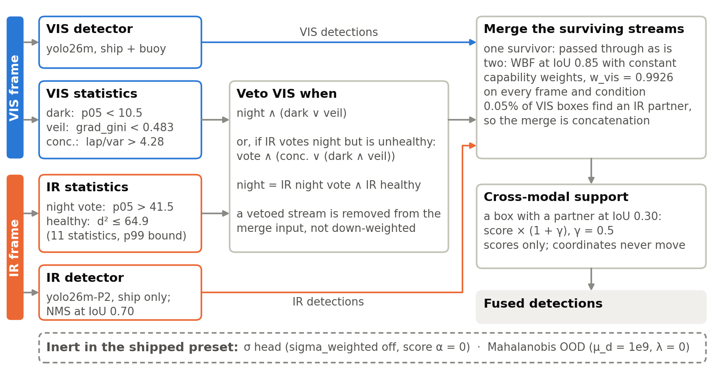
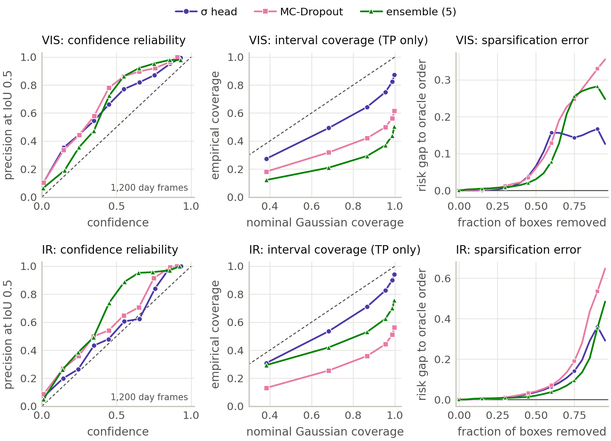
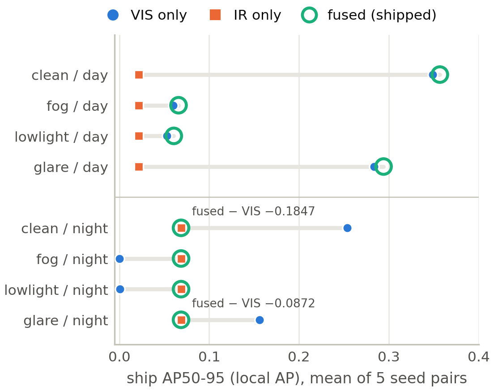
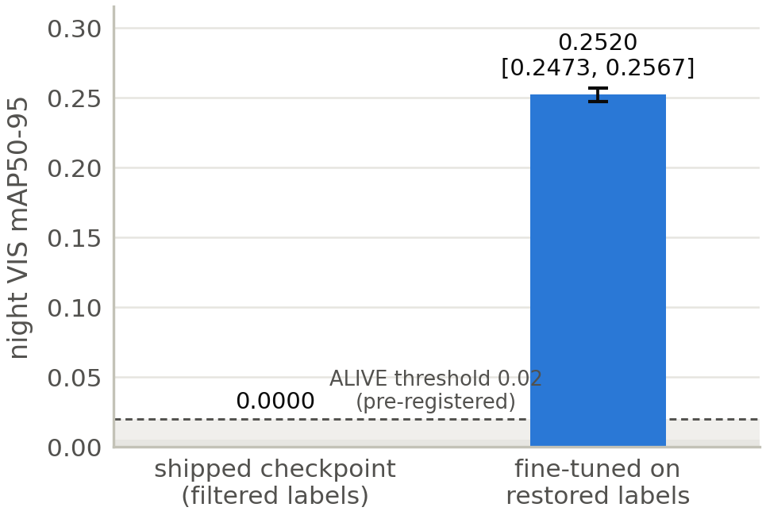
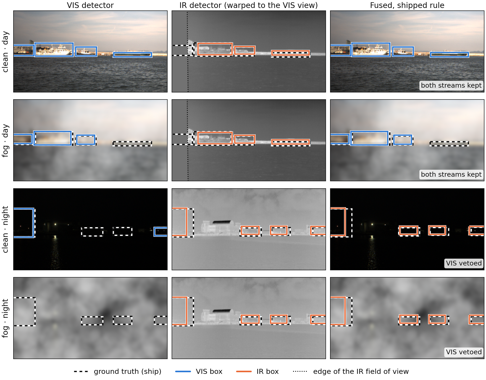
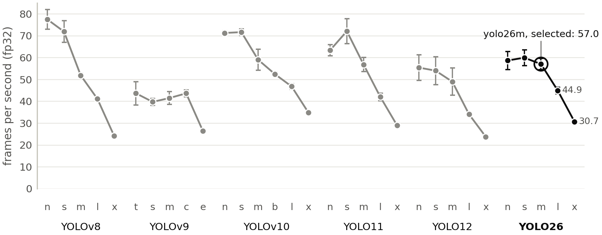
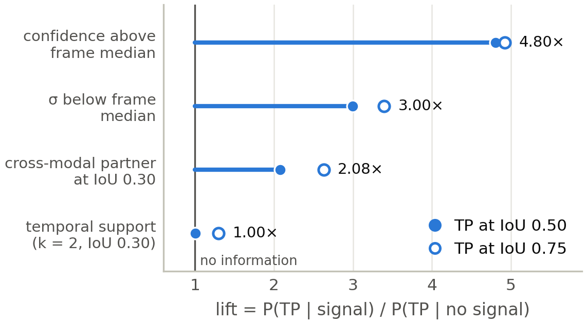
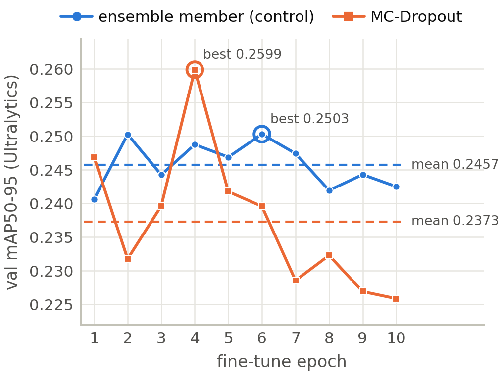
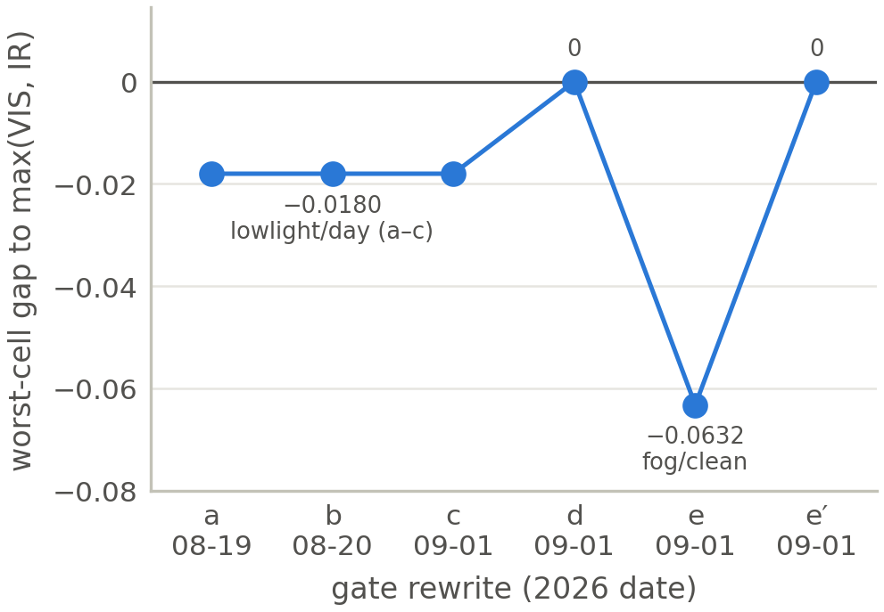

# Predicted Uncertainty Is Informative but Does Not Improve Visible–Infrared Maritime Detection: A Pre-Registered Test, and a Sensor-Selection Rule That Broke When Its Detector Was Retrained

**Anonymous authors** (TMLR review is double-blind; restore the author block for the camera-ready).

> Venue draft for TMLR, derived from `PAPER_DRAFT2.md` at commit `d9260ef` (2026-10-09) by `venues/build_long_drafts.py`. TMLR has no hard page limit, but a main body over 12 pages gets a longer review. The main body is cut toward 15 typeset pages: condensed subsections keep their headings, and their full text, four tables and one figure move to appendices A–M, in the order of the sections they come from. Every number is from Draft 2. See `venues/README.md`.

---

## Abstract

We pre-registered a test of whether predicted uncertainty should decide how a two-stream visible–infrared maritime detector fuses its streams. On the Pohang Canal dataset with PoLaRIS boxes, independent YOLO26 detectors with single-pass Gaussian variance heads feed a decision layer, and the registered comparison is real predicted σ against the same σ shuffled onto the wrong boxes, on ship AP, with a 0.0060 floor and block-bootstrap intervals. As a coordinate weight σ passes on zero of four conditions; as a score re-ranker it passes on three, so it is informative. It is not useful: the signal lies within each detector's own boxes, the σ-scored system is below the system with no σ on six of eight cells, and a learned within-detector variant failed its pre-registered replication on five retrained detectors (positive on all five, beyond the floor on two). The recorded runs had scored a ship-and-buoy macro instead of the registered metric, and the macro read NULL on both paths; we argue that the scored quantity belongs in the registration. The mechanism that shipped instead, an image-statistic veto with union aggregation, beats the visible stream by day on five retrained systems (+0.0059 to +0.0107 AP) but discards a working visible stream at night (−0.1847) once a label artifact behind its night arm was corrected. Paired noise floors, dependence-aware intervals and magnitude floors moved 20 of 74 earlier findings to indeterminate, and one logged look at an untouched run returns a gap of +0.0216 that excludes neither zero nor 0.05.

---

## 1. Introduction

Maritime detection systems increasingly pair a visible camera with a thermal camera on the assumption that the two fail in different conditions. Visible imagery degrades in fog, haze, glare, rain and darkness. Infrared sees through glare and darkness but fails during thermal crossover, when vessel and water reach the same temperature. Neither failure announces itself. A detector that has stopped seeing simply emits fewer boxes, which a naive fusion rule reads as low uncertainty rather than as a blind sensor. The problem this project set out to address is therefore not accuracy but reliability: whether the system can tell, frame by frame, which stream to believe.

Maritime YOLO variants such as RDSC-YOLOv4 (Liu et al., 2021) and YOLOv7-Sea (Zhao et al., 2023) report accuracy and output no uncertainty. Outside the maritime domain, single-pass localization variance is established (Gaussian YOLOv3; Choi et al., 2019), and uncertainty-aware visible–infrared detection is established too (UA-CMDet, Sun et al., 2022; Zhao et al., 2024). We claim neither the variance head nor the idea of conditioning fusion on uncertainty as new. What is thin is the maritime evidence: whether such uncertainties are calibrated on paired VIS and LWIR maritime video, and whether the uncertainty doing the conditioning is itself trustworthy when measured with dependence-aware intervals against a stated noise floor, with null results reported.

This paper is a pre-registered study whose primary test returned a split answer. We designed a system in which a per-modality reliability score, combining box-level aleatoric variance and frame-level distributional distance, would weight the two streams instant by instant. We built it and measured every component. As the fusion weight it was designed to be, the uncertainty moves nothing. As a score re-ranker, real uncertainty beats shuffled uncertainty by the registered margin, so it carries information about which boxes are right. But it carries that information within each detector, not between them, and spending it at the registered strength costs more accuracy than it recovers. Learned jointly with confidence instead, it gives a small within-detector gain that a pre-registered replication on five retrained detectors found consistent in sign but too small to claim. We report both answers with the decision rule fixed in advance. We also report a deviation we found late: the recorded runs scored a different metric from the registered one, and the registered metric reverses the score-path verdict. Finally, we report the mechanism that worked in place of uncertainty, and the measured way in which it later failed.

Three contributions are defensible:

1. **A pre-registered test with a split answer.** As a coordinate weight in the fusion, real σ does not beat the same σ shuffled onto the wrong boxes on any of four conditions at a 0.0060 AP floor (R-D1), and letting σ arbitrate relaxed cross-modal correspondences does not rescue it (Stage 1, S1-NULL). As a score re-ranker, real σ beats shuffled σ on three of four conditions on the registered metric, ship AP, so the uncertainty is informative. It is not useful: the re-ranking is within each detector's own boxes, and the σ-scored system is below the shipped system without σ on six of eight cells (§6.4). Learned jointly with confidence, σ's within-detector gain is positive on all five retrained detectors but fails its pre-registered replication at the floor (§6.8).
2. **A sensor-selection baseline, and a measured account of how it broke.** A hard veto of the form `night AND (dark OR veil)`, computed from image statistics, with union aggregation of the surviving detections. In daylight it improves on the visible stream alone on all four day cells, for both checkpoint generations (+0.0059 to +0.0107 AP on the five retrained systems). At night it is right where the visible detector is degraded and wrong where it is not. Its night arm was justified by a label-filtering artifact. Once the visible detector is trained on restored night labels, the unchanged rule discards a working stream and costs 0.1847 AP on clean night (§6.6). A rule of this kind encodes a claim about the detector, not about the image, and must be re-priced whenever the detector changes.
3. **An evaluation protocol that changed the conclusions.** A measured noise floor, dependence-aware intervals, magnitude floors, an exposure ledger, and a single pre-registered look at an untouched run. Applied retroactively, the protocol moved 20 of 74 earlier findings to indeterminate. It also reports the held-out result as what it is: a gap of 0.0216 that the data cannot distinguish from zero or from 0.05.

The project's stance, stated in its scope document and enforced throughout, is that null results are results: decisions were pre-committed, stop rules were honoured, and every time a held-out number was looked at it was logged.

## 2. Related work

### 2.1 Uncertainty in single-stage detectors

Gaussian YOLOv3 (Choi et al., 2019) attaches a per-coordinate Gaussian to the box regressor, trains it with a negative log-likelihood, and at inference multiplies each box's detection score by one minus its mean predicted uncertainty. We follow the head and the loss; our σ moves no score (§4.2). Heteroscedastic NLL has a known failure mode in which the network explains away hard examples by inflating variance instead of improving the mean (Seitzer et al., 2022). We use two mitigations: Seitzer et al.'s beta-NLL weighting, and a warm-up in which the mean trains first, which Skafte et al. (2019) describe as the most common training strategy before proposing a split alternative. Deep Evidential Regression (Amini et al., 2020) was considered and not benchmarked. MC-Dropout (Gal and Ghahramani, 2016) and deep ensembles (Lakshminarayanan et al., 2017) are the reference alternatives for producing the uncertainty signal on the same backbone; §3.6 and §6.2 explain why a three-arm comparison is reported only on development data.

### 2.2 Visible–infrared fusion with uncertainty

UA-CMDet (Sun et al., 2022) detects vehicles in paired drone RGB–IR images with a two-stage oriented detector. Its uncertainty belongs to annotations and is not predicted: a rule built from the cross-modal IoU of the two modalities' ground-truth boxes and from the RGB image's illumination weights each object's training loss, and the module is removed after training. At inference an illumination-aware NMS multiplies the RGB branch's scores by the image's illumination weight before merging the RGB, IR and fusion branches, which is genuinely per-frame adaptive. Zhao et al. (2024) fuse visible and infrared backbone features with an attention module and weight the visible and infrared branch losses by a label uncertainty estimated during training from each branch's own predictions; that module is also removed at inference. Neither paper evaluates calibration; both report mAP only. The closest prior mechanism to our shipped decision layer is therefore UA-CMDet's illumination-weighted NMS: both demote the visible stream on a statistic of the image rather than on a predicted uncertainty. Ours removes the stream outright, and only when IR votes night (§4.2). An earlier draft of this project claimed that existing VIS–IR fusion is static; that claim was wrong and is withdrawn. Learned attention is not static merely because its parameters are frozen at inference: the attention values still depend on the input.

### 2.3 Maritime detectors and datasets

The maritime YOLO variants cited in §1 report accuracy without uncertainty: RDSC-YOLOv4 lightens YOLOv4 for an unmanned surface vehicle, and YOLOv7-Sea adds a small-object head, an attention module and five-scale test-time augmentation for drone search and rescue. The Pohang Canal dataset (Chung et al., 2023) is the sensor release; PoLaRIS (Choi et al., 2025) is a separate, later annotation release providing ship and buoy boxes on the visible and thermal images. The Singapore Maritime Dataset (Prasad et al., 2017) offers visible and near-infrared videos that do not necessarily show the same scene, so it is not a paired fusion testbed. MassMIND (Nirgudkar et al., 2023) is long-wave infrared only, labelled by instance segmentation in seven categories that are not a ship/buoy taxonomy, and no instance-to-class mapping exists in our repository. The MIT Marine Perception dataset was planned and never onboarded; no data, code or annotation from it exists in this work.

### 2.4 Comparison axes

Table R (Appendix A) positions this work against Gaussian YOLOv3, UA-CMDet, Zhao et al. (2024), RDSC-YOLOv4 and YOLOv7-Sea on uncertainty target, inference-time adaptation, calibration, registration and compute; every cell for another work comes from a direct read of its full text. Of the six systems it lists, this work is the only one that evaluates calibration. The two VIS–IR systems use uncertainty only as training-loss weights, removed at inference, and the maritime detectors output none.

## 3. Dataset

### 3.1 Pohang Canal and PoLaRIS

The Pohang Canal dataset (Chung et al., 2023) covers a 7.5 km route through canal, inner and outer port, and near-coastal water, recorded by the KAIST MORIN lab, and is distributed under CC BY-NC 4.0 (AWS Open Data registry entry). It provides hardware-synchronized stereo visible video at 2048×1080 and a thermal camera at 640×512, stored as 16-bit PNG holding 14-bit thermal data, both at 10 Hz; the dataset paper notes that some thermal intervals run long because of the camera's thermal calibration. The files agree: on pohang00–03 the timestamp files give a median interval of 100.0 ms for both cameras, with intervals over 150 ms on at most 0.10 percent of frames (longest 0.93 s, pohang03 IR; `docs/eval/frame_intervals_2026-10-08.md`), and the image sizes and bit depth match. PoLaRIS (Choi et al., 2025) supplies boxes for two classes, ship and buoy, which we use in YOLO format. There are five runs: pohang00 (day, dense in both modalities), pohang01 (night), and pohang02 to pohang04 with varying IR coverage. pohang04 has no IR labels at all. The two cameras are not spatially co-registered; frames are paired by nearest timestamp, and the residual misalignment was measured rather than assumed at 3–6 px median per run, with within-run swings of up to about 10 px.

### 3.2 Verified counts

Counts were re-derived from disk: 158,319 images (127,309 VIS, 31,010 IR), 1,183,736 boxes and 28,388 paired frames. Pairing follows the dataset's own timestamp table, not frame ordinals; 16,544 of the pairs have different VIS and IR indices. Per-run counts are in Appendix B.1.

### 3.3 Preprocessing

VIS frames are letterboxed from 2048×1080 into a 640×640 canvas, so 47 percent of every stored VIS frame is pad (which matters in §3.5). IR frames are min–max normalized per frame to 8 bits, which can mask thermal crossover and removes cross-frame radiometric comparability. Details, and a rejected percentile-clip export, are in Appendix B.2.

### 3.4 Splits

An interleaved K-block split with guard bands gives 80/10/10 train, validation and test per run, using the same ordinals for both modalities so that VIS–IR pairs never straddle a split. Sizes (Table S) are in Appendix B.3.

### 3.5 The night-box filter and its reversal

A train-only filter (2026-07-15) removed every box in night-run frames whose content-median luminance was below 100, on the reasoning that such boxes were copied from the thermal annotations. A padding constant bug made it cut whole frames: it dropped 132,688 boxes, of which only 38,135 individually fail intensity, gradient and contrast tests. A pre-registered restore (2026-09-02) put back all but those 38,135, a net gain of 94,553 boxes. §6.6 reports the result. The label accounting (Table D) and two provenance anomalies are in Appendix B.4.

### 3.6 Holdout and contamination

pohang04 (26,188 VIS images, no IR) is the held-out run, but its visible labels are **not unseen**. Earlier VIS detectors, including the VIS ensemble and MC-Dropout arms, trained on 9,841 of its frames, and two VIS-only probes scored a validation list that included 2,343 of them (§6.8). No fusion score was ever computed on it, and the ten Phase 3 checkpoints and the Mahalanobis references built from them never saw it; the held-out claim of §7 rests on those facts and no wider one. Removing pohang04 from the Phase 3 lists raises the validation night share from 18.2 percent to 23.0 percent, so Phase 3 numbers are not comparable to earlier pooled validation numbers. List sizes and a contamination audit of the earlier Mahalanobis references are in Appendix B.5.

## 4. Method

We describe the system in two layers and label them. The first is what was designed. The second is what ships and what every result in §6 measures. Every divergence between the two was measured, not assumed.

### 4.1 As designed

Each modality runs its own YOLO backbone with separate weights. From each backbone a Gaussian σ² head produces per-box aleatoric uncertainty and a Mahalanobis distance on backbone features produces a frame-level out-of-distribution score. Per frame and per modality m:

- size-normalized per-box uncertainty `u_i = ¼ Σ_t σ_{i,t} / s_{i,t}` over t in {x, y, w, h}, with s the box width or height;
- confidence-weighted frame aggregate `U_box,m = Σ_i c_i u_i / Σ_i c_i`;
- calibrated OOD score `O_m = sigmoid((d_m − μ_d) / τ)`;
- reliability `R_m = r_frame,m · r_box,m` with `r_box,m = exp(−λ U_box,m)` and `r_frame,m = 1 − O_m`, falling back to `r_frame,m` on empty frames;
- temporal smoothing `R̄_m(t) = α R_m(t) + (1 − α) R̄_m(t−1)`;
- fusion weight `w_m = R̄_m / (R̄_vis + R̄_ir)` fed to Weighted Boxes Fusion (WBF; Solovyev et al., 2021).

The design document itself marked every constant and the multiplicative form as choices to be validated empirically. They were, and the validation is the subject of this paper.

### 4.2 As shipped (preset `crossmodal26m`)

**Detectors.** VIS uses yolo26m (Jocher et al., 2026) with two classes. IR uses yolo26m with a P2 feature neck and a single class, because IR cannot see buoys: its buoy AP50-95 is 0.0002. Backbone selection is in §6.1.

**Gaussian head.** A fresh log-variance branch is attached to the live detection head of a loaded model, with no fork of the training library, and trained with a fourth loss term, beta-NLL (Seitzer et al., 2022), after a warm-up during which the NLL weight is zero. The σ branch reads detached features and the NLL sees a detached mean, so the deterministic detector is intended to train identically to the baseline by construction; §9 reports that this parity is not yet demonstrated. The port to YOLO26's end-to-end head is in Appendix C.

**Mahalanobis OOD score.** Following Lee et al. (2018), backbone features are captured by a forward hook and scored against a Ledoit–Wolf covariance (Ledoit and Wolf, 2004) fit on a reference set of clean training frames. In the shipped preset the parameters `mu_d = 1e9` and `lam = 0` make this score mathematically inert in the fusion weight. It is retained as a diagnostic and discussed in §6.3 and §8.

**Decision layer.** The shipped decision layer is a hard sensor-selection veto followed by union aggregation (Figure 1).

1. *Night vote.* The IR stream is asked whether it is night by a 5th-percentile luminance test (`ir_p05 > 41.5`, fitted once on clean IR and frozen). IR may cast that vote only while it still looks like IR: an 11-statistic multivariate health score over the IR frame (gradient Gini, the ratio of Laplacian to variance and nine other frame statistics) must stay within an authority bound at the 99th percentile of clean statistics. `night` is the vote of a healthy IR frame. The fit is not out-of-sample. The threshold is a midpoint that includes the night minimum of the evaluation night run, and the health model was fitted on all clean paired IR frames, night included. Their 0 percent clean error rates are therefore in-sample (§9).
2. *VIS statistics.* Three single-frame statistics, none temporally filtered. `dark` is a 5th-percentile luminance below 10.5. `veil` is a scale-free Gini coefficient of gradient magnitude (`grad_gini`) below 0.483; it was 100 percent correct on fog and 0 percent false-positive elsewhere during development. `concentrated` is a ratio of Laplacian to variance above 4.28, the signature of point highlights on an otherwise empty field at night.
3. *Rule.* VIS is vetoed when `night AND (dark OR veil)`, so a veiled VIS frame need not also read dark. When IR votes night but fails its health check, its vote is not believed but may be confirmed: VIS is still vetoed if its own frame shows `concentrated OR (dark AND veil)`. A vetoed stream is removed from the WBF input list rather than down-weighted, because WBF renormalizes whatever weights it is handed; down-weighting alone left a genuinely blind stream with weight 0.432.
4. *Single survivor.* A frame with one surviving stream returns that stream's detections untouched.
5. *Merge.* Surviving streams are passed to WBF at IoU threshold 0.85 with constant capability-prior weights: each stream's clean mAP50-95 against VIS ground truth on the 1,200 clean day paired frames, with IR's divided by 4 (VIS 0.3233, IR 0.0024 after the division, so `w_vis` = 0.9926; `runs/eval/levers_26m.json`). The prior excludes the night run but not the day frames that every day cell is scored on (§9). At this threshold only 0.05 percent of VIS boxes have an IR partner, so the merge is concatenation; we document the merge as effectively off.
6. *Cross-modal support.* A score multiplier is applied to boxes with a partner at IoU 0.30 (γ = 0.5). It confirms but never moves a coordinate.
7. *IR dedup.* The IR stream is de-duplicated with NMS at 0.70 before merging.

**What is off.** `sigma_weighted = False` (σ never moves a fused coordinate), `sigma_score_alpha = 0` (σ never moves a fused score), the Mahalanobis weight is inert as above, and VIS soft-NMS is off following a pre-registered rejection (§6.8). The measured consequence is that the fusion weight `w_vis` takes exactly one value across all 2,232 paired evaluation frames and all four corruption conditions. That value is 0.9926 under `crossmodal26m` (8,928 frame-condition pairs) and 0.9930 under the predecessor `crossmodal`.

**Two presets, stated once.** `crossmodal` (2026-09-01) vetoes VIS on `veil OR (night AND dark)`, so it drops VIS on every fog frame, day or night. `crossmodal26m`, which ships, vetoes on `night AND (dark OR veil)`, adds a weak night fallback and the cross-modal support term, and keeps both streams on day fog. Every result below names the preset it was measured under.

**Figure 1. The shipped decision layer (preset `crossmodal26m`).** Frame statistics from both streams drive a hard veto on VIS; the surviving streams are merged by WBF with constant capability weights, so `w_vis` = 0.9926 on all 2,232 paired frames and all four conditions, and at IoU 0.85 the merge is concatenation. A cross-modal partner at IoU 0.30 raises a box's score and never moves it. Thresholds are the frozen constants the code loads (`runs/eval/structure_constants.json`, `runs/eval/brightness_constants.json`); the night threshold and the IR health model are fitted in-sample (§9). The σ head and the Mahalanobis score are computed but inert.

## 5. Experimental protocol and statistics

### 5.1 Benchmark cells and substrates

The development benchmark uses 2,232 paired VIS–IR frames from the validation split. Eight cells cross four conditions (clean, fog, low-light, glare) with day and night. Later grids add IR-side corruptions for ten or eleven cells. Adverse conditions are simulated with Albumentations (Buslaev et al., 2020) (fog, sun flare, rain, motion blur, Gaussian and ISO noise); they are not field-collected. Night frames come from a single run, pohang01. Day-only slices on 9,284 frames are used where noted.

### 5.2 Tune and test discipline

From 2026-09-01 onward every lever was tuned on TUNE = pohang00 (836 paired frames) and reported on TEST = pohang02 + pohang03 (364 frames), with pohang01 excluded from fitting. The split caught a real overfitting trap immediately: a support IoU of 0.55 won on TUNE but lost on all six held-out variants, while 0.30 won on all six. Under the earlier single-set practice both would have read as wins and the wrong one would have been adopted.

We state plainly that this repository contained no untouched test set before the pohang04 look. pohang00 and pohang01 were held out of gate fitting but scored repeatedly; pohang02 and pohang03 were declared TEST after the fact and already fail a model-selection-bias test, because a candidate was rejected specifically for losing on them; and the code's "fit" selector was literally identical to its "day" selector, so every fit-run day constant was reported on the frames it was tuned on. A `role="final"` evaluation context now structurally refuses any frame selector that spans scoring frames, and it is the mechanism that protects the single look in §7.

### 5.3 Noise floor

Deltas between systems are always paired on the same frames and the same corruption draw, which tightens the standard deviation of a delta by 3–16× on the nine informative cells. The combined draw-plus-bootstrap two-sigma floor on a paired delta is 0.0014–0.0031 AP on the macro over ship and buoy and 0.0008–0.0024 on ship AP, re-measured with the same arm, cells, draws and resamples; the maximum sets the magnitude floor in §5.4. Buoys carry 74–75 percent of the macro's variance while making up 5.3 percent of day ground-truth boxes. A delta below the floor is reported as "not resolved," never as "no effect." Sources and the two zero-information cells are in Appendix D.1.

### 5.4 Dependence-aware intervals

Frames at 10 Hz are autocorrelated, and a frame-level iid bootstrap underestimates the standard error. We measured the inflation with moving-block bootstraps (Künsch, 1989) up to block length L = 20 (2 s), the longest the shortest run (pohang03, 117 paired frames) permits: intervals widen by 1.9× to 1.99×. Two qualifications apply. First, this is a lower bound, because the block length is capped by the shortest run, not chosen from the autocorrelation. Second, it was measured on deltas between VIS uncertainty arms and then applied to fusion cells, where it was not re-measured. From 2026-09-10 onward every new interval is a block-bootstrap interval, and the factor 1.95 sets the Phase 3 magnitude floor at 0.0060 rather than 0.0031. Built the same way from the ship-AP floor (§5.3) it would be 0.0047, so 0.0060 is conservative for the ship-AP verdicts, and no recorded verdict changes at 0.0047 (§6.3, §6.5, §7). Night, being a single run, has no block length at which a between-night-run interval is estimable.

### 5.5 AP convention

All absolute AP values use local linear-interpolation AP with the project's maximum detection count, not COCO AP (Lin et al., 2014). The two conventions disagree on deltas by at most 0.000285, five times below the noise floor, so no decision can flip on convention; they disagree on absolutes by up to −0.0050, so every absolute value states its convention. The one table outside this convention is Table 1, the backbone benchmark: it reports the training library's own validation mAP (Ultralytics 8.4.90, ship and buoy), because it is read from training logs, says so in its caption, and none of its values is set beside a local-AP number. Two training-library versions (8.4.7 and 8.4.90) disagree on mAP50-95 by about 0.034 for identical weights and data; no table in this paper places numbers from different library versions side by side.

**Class set.** Ship is the primary class. It is the only class both detectors emit, since the IR detector is single-class (§4.2), and the Phase 3 pre-registration fixed fused ship AP as its quantity before any Phase 3 number existed. Tables report ship AP except Table 1 and Table 4c (the macro over ship and buoy), Table 2 (both classes per stream) and two rows of Table L, each of which says so; the constants re-price of Appendix G is on the macro its registration scored. Rows recorded on the macro were re-scored on ship from cached detections, each after its unchanged macro path reproduced the record. The macro is not a safe stand-in for ship AP: a VIS veto deletes every buoy, because the surviving IR stream cannot supply one; buoys carry 74–75 percent of the macro's variance (§5.3); and a single-class stream scored on the macro reads exactly half its ship AP. R-D1 shows the cost: its macro read NULL where its registered ship AP reads POSITIVE (§6.4). The full accounting is in Appendix D.2.

### 5.6 Metric contracts

Six claims about the uncertainty metrics were tested and hold (Appendix D): D-ECE, the confidence-only form of the detection calibration error of Küppers et al. (2020), conditions on confidence only; AUSE (Ilg et al., 2018) and AURC (Geifman et al., 2019) are ranking-only; NLL and interval-ECE are computed on true positives and published with their true-positive share. One defect is disclosed rather than repaired: WBF can emit fused confidences above 1.0 (maximum 1.7532, on 0.0641 percent of detections).

### 5.7 Pre-registrations and decision rules

The verdicts below were fixed in advance; the other results in §6, including Table 3a, most of Table L and the first σ re-ranker ablation, are descriptive and are labelled so. The registrations and their rules are: the night-label restore (ALIVE bands and a day guard); the re-pricing of inherited constants (margin 2·hypot(sd_draw, sd_paired)); soft-NMS (Bodla et al., 2017) adoption (every cell non-negative, draw-averaged); the R-D1 mechanism ablation (at least three of four conditions above a 0.0060 floor with block-bootstrap CI excluding zero); the Phase 3 retrain with nine append-only amendments; the Stage 1 correspondence crossing (non-inferiority within 0.0060 on at least three of four conditions); the σ re-ranker replication (σ's paired increment at or above 0.0060, or 0.0047 for a weaker pass, with block-bootstrap CI above zero, on at least four of five Phase 3 seeds; §6.8); and the pohang04 single look (§7). After the interval and convention corrections were applied retroactively, 20 of 74 previously significant fusion findings became indeterminate; the large effects (removing the veto on night, fog and glare; the veil repair at +0.0716) survived. That count widens the recorded intervals by the 1.95 factor rather than re-scoring each finding, so it inherits the factor's qualifications from §5.4.

### 5.8 Identity checks and power

A one-frame shift in cache pairing moves gated fusion by −0.000968, below the noise floor; only a content identity check, now run on every cache load, catches it. Before Phase 3, minimum detectable effects with five seeds were computed (VIS 0.01291, IR 0.01010); neither reaches the 0.0060 floor, so the retrained-versus-deployed comparison was cut in advance and is not reported (Appendix D).

## 6. Results

### 6.1 Backbone benchmark is a negative result

Ninety-three training runs, 31 YOLO variants with three seeds each from six families (YOLOv8, Jocher et al., 2023; YOLOv9, C.-Y. Wang et al., 2024; YOLOv10, A. Wang et al., 2024; YOLO11, Jocher and Qiu, 2024; YOLO12, Tian et al., 2025; YOLO26, Jocher et al., 2026), were trained on the restored labels to a patience-20 stop. On the training library's own validation mAP over ship and buoy (not local AP), the top three, yolo26x (0.2666 ± 0.0040), yolo26l (0.2664 ± 0.0070) and yolo26m (0.2626 ± 0.0109), differ by less than the larger seed sd of every pair: a YOLO26 m/l/x tier with no resolved order. yolo26m was chosen earlier, on the Phase 1 grid, under a rule fixed in advance; it stays inside the tier and runs at 57.0 FPS per detector against 30.7 for yolo26x (fp32, detector `predict()` only). The full table (Table 1), the Phase 1 selection record (Table 1b), the throughput of every variant (Figure 2), the disclosures and the IR architecture ladder are in Appendix E.

### 6.2 Per-modality uncertainty calibration

**Table 2. Per-stream uncertainty calibration, three arms, day slice (1,200 of the 2,232 paired validation frames), no fusion. Lower is better on every column except the two AP columns, which are local AP50-95 per class; best arm per stream and column in bold.** One checkpoint per arm, trained on restored labels. The IR detector is single-class (§4.2) and has no buoy AP. Ties in the MC-Dropout and ensemble uncertainties move AUSE and AURC by up to 6×10⁻⁴ and change no ordering. Sources, checkpoints and the tie analysis are in Appendix F.1.

| Stream | Arm | D-ECE | interval-ECE | AUSE | AURC (grid) | NLL (TP-only) | ship AP | buoy AP |
|---|---|---:|---:|---:|---:|---:|---:|---:|
| VIS | σ head | 0.1119 | **0.1693** | **0.0731** | **0.4662** | 3.91 | 0.3782 | 0.2987 |
| VIS | MC-Dropout | 0.1316 | 0.3788 | 0.1153 | 0.5709 | — | 0.3475 | 0.2731 |
| VIS | ensemble (5) | **0.0840** | 0.4888 | 0.0950 | 0.5995 | — | **0.3877** | **0.3050** |
| IR | σ head | 0.0568 | **0.1079** | 0.0856 | **0.8344** | 2.70 | 0.1414 | n/a |
| IR | MC-Dropout | 0.0806 | 0.4351 | 0.1296 | 0.8455 | — | 0.1382 | n/a |
| IR | ensemble (5) | **0.0477** | 0.2576 | **0.0775** | 0.8983 | — | **0.1488** | n/a |

**What the table says.**
* **Ensemble:** the best confidence calibration (D-ECE) and the highest mAP on both streams.
* **σ head:** the best interval calibration by 2.2–4.0×, and the best AURC on both streams. It is the only arm with a likelihood at all, so the only arm whose uncertainty is a usable number rather than a ranking.
* **MC-Dropout:** last or near-last on nearly every column.

No arm wins everywhere, and the ordering depends on whether one asks for calibrated confidence or calibrated intervals (Figure 3). That is a calibration result, not a detection result. mAP differences here come from one checkpoint per arm and are not a ranking (Appendix F.4).

**Figure 3. Per-stream calibration of the three uncertainty arms, day slice (1,200 of the 2,232 paired validation frames), no fusion; the primary basis of Table 2.** Left: precision at IoU 0.5 against confidence in D-ECE's ten bins (bins with at least 20 boxes). Middle: empirical against nominal Gaussian coverage of |error| ≤ kσ for k = 0.5–3, true positives only; for MC-Dropout and the ensemble σ is member disagreement (§6.2). Right: risk (1 − IoU, a false positive counting 1) of the retained boxes minus the oracle ordering's, as the most uncertain boxes are removed; its mean over the grid is AUSE. Dashed lines are perfect calibration. Recomputed from Table 2's caches with the same metric code: D-ECE and interval-ECE reproduce Table 2 exactly, AUSE and AURC to within the spread across tie orders (see Table 2's note). Source: `docs/eval/uq_day_night_slice_u2_nanpolicy_2026-09-09.md`.

**Scope.** These are development-data numbers from single checkpoints that are neither Phase 3 checkpoints nor fusion inputs; R-D1 (§6.4) tests the σ head only. The VIS MC-Dropout and ensemble arms trained on 9,841 pohang04 frames (§3.6), so no three-arm number may appear on the held-out run. For those two arms the registered estimand is disagreement ranking, not predictive likelihood, so their NLL is undefined. Night is SUSPECT on both streams (Appendix F.2).

The σ head is evaluated here as a localization-error-scale estimate on its own terms, not as a fusion input. Signal screens support that reading: boxes with σ below the per-frame median are true positives 3.00× more often than chance (3.39× at IoU 0.75), the second-strongest signal after confidence (4.80×; Figure 4). But σ is informative about error magnitude, not direction: leave-one-run-out ridge regression finds live out-of-fold R² on only two of four box edges (0.017–0.098), and applying a σ-driven coordinate correction end to end costs 0.02–0.11 mAP.

Figure 4 (Appendix F.3) shows the full lift screen. Day-only is the primary basis because the registered screen placed night in its SUSPECT band on both streams; that rationale, one registered rule amended after it fired, and why the arms are not ranked on mAP (Figure 5) are in Appendix F.4.

### 6.3 Fusion robustness of the sensor-selection baseline

The decision layer of §4.2 is the sixth rewrite of the gate; each rewrite was forced by a measured failure of the previous one. The history (Table 3a, Figure 6), the pre-restore measurements behind it and its three general lessons are in Appendix G.1; two of the lessons recur in §8. Here we re-measure the shipped rule on the five Phase 3 systems.

**Table 3b. The shipped rule on the five Phase 3 systems (VIS seed k + IR seed k), `crossmodal26m`, development paired frames (1,200 day / 1,032 night), clean IR, ship AP (local AP).** AP is the seed mean; corrupted cells average four corruption draws (VIS 941–944) per seed before averaging seeds. Deltas carry the between-seed 95% t-interval (df 4). Sources: `docs/eval/p3_night_check_2026-09-27.md` (clean), `docs/eval/p3_corrupt_cells_2026-09-27.md` (corrupted, severity 2), `docs/eval/p3_fog_s1_2026-09-27.md` (fog severity 1, the two supplementary rows).

| Cell | VIS only | IR only | Fused (shipped) | Fused − VIS | VIS veto rate | Fused ≥ max(VIS, IR) |
|---|---:|---:|---:|---|---:|---|
| clean / day | 0.3485 | 0.0218 | **0.3566** | +0.0081 [+0.0047, +0.0115] | 0% | holds |
| fog / day | 0.0601 | 0.0218 | **0.0659** | +0.0059 [+0.0036, +0.0082] | 0% | holds |
| lowlight / day | 0.0531 | 0.0218 | **0.0607** | +0.0076 [+0.0039, +0.0112] | 0% | holds |
| glare / day | 0.2833 | 0.0218 | **0.2940** | +0.0107 [+0.0079, +0.0135] | 0% | holds |
| clean / night | 0.2535 | 0.0687 | **0.0687** | −0.1847 [−0.2039, −0.1655] | 100% | **fails** |
| fog / night | 0.0003 | 0.0687 | **0.0687** | +0.0685 [+0.0618, +0.0751] | 100% | holds |
| lowlight / night | 0.0005 | 0.0687 | **0.0687** | +0.0682 [+0.0610, +0.0755] | 100% | holds |
| glare / night | 0.1559 | 0.0687 | **0.0687** | −0.0872 [−0.1047, −0.0697] | 99.8% | **fails** |
| *fog s1 / day* | 0.0834 | 0.0218 | **0.0895** | +0.0061 [+0.0041, +0.0081] | 0% | holds |
| *fog s1 / night* | 0.0004 | 0.0687 | **0.0687** | +0.0684 [+0.0612, +0.0755] | 100% | holds |

On the retrained systems the claim holds on six of eight cells and fails on two (Figure 7); the fail criterion was fixed in the exposure ledger before scoring. The two italic rows are fog at severity 1, the middle of the fog range, added as a descriptive check and not one of the eight cells. Lighter fog lifts VIS from 0.0601 to 0.0834 by day and leaves it at zero by night, and both rows hold with the same margins as severity 2.

**Figure 7. The shipped rule on the five Phase 3 systems (Table 3b), ship AP (local AP), seed mean.** By day the fused output sits just above VIS alone on every cell. At night VIS is vetoed on every frame, so the fused output equals IR alone: right where VIS fails (fog, low light), wrong where it still works (clean, glare). Sources: `docs/eval/p3_night_check_2026-09-27.json`, `docs/eval/p3_corrupt_cells_2026-09-27.json`.

**Day, all four cells.** The veto never fires, so the fused output is the union of both streams. It sits above VIS alone on every day cell, with every between-seed interval clear of zero: +0.0059 to +0.0107. The gain is small. On fog/day it is just below the 0.0060 magnitude floor, so it is resolved in sign but not beyond the floor there.

**Night: right where VIS is degraded, wrong where it is not.** On fogged and low-light night frames the Phase 3 VIS detector scores about zero, and dropping it is correct: fused output beats VIS alone by about 0.068. On clean and glared night frames VIS still works, at 0.2535 and 0.1559. Dropping it costs 0.1847 and 0.0872, and the fused output falls to the IR level, 0.0687. The split is exactly the one the earlier night-veto registrations found (§6.6). The rule gates on *darkness*, while what decides whether VIS should be dropped is *VIS health*. With the pre-restore detector, which scored 0.0000 at night, those two variables were the same. After retraining they are not.

For clean/night alone, removing the night arm would give 0.2895, above VIS alone by 0.0360. We do not adopt that. The rule is frozen, and the fog and low-light night rows above show why removing the arm would fail the other half of the night cells.

### 6.4 Uncertainty is informative but does not improve the fusion (R-D1)

The system was designed so that predicted uncertainty would weight the fusion. As shipped it does not, and we asked whether it could. The pre-registered comparison is not real σ against a constant, since inverse-variance weighting with equal σ reduces analytically to plain WBF. It is real σ against the same σ values shuffled onto the wrong boxes. Eight arms were scored:
* S0, the system as shipped;
* S1–S4 on the coordinate path: real, constant, shuffled within frame, shuffled across cache;
* S5–S7 on the score path, which multiplies each box's score by (frame-median σ / σ)^α, with the median taken within the frame and within the box's own stream: real, constant, shuffled within frame, with α fixed at 1.0 before the run and never tuned.

The rule, applied to each path separately, was at least three of four conditions with a delta of at least 0.0060 and a block-bootstrap CI excluding zero. Both pre-registrations name the metric as gated-fusion ship AP. R-D1 ran first under the predecessor preset `crossmodal`. It was re-run under the shipped `crossmodal26m` with everything else held fixed, pre-registered before the run. Both use the pre-restore full-scale checkpoints.

**A deviation, found late.** Both recorded runs scored the macro over ship and buoy, not ship AP. We found this on 2026-10-08, after earlier drafts had reported the macro's verdict, NULL on both paths, as this paper's headline. We then re-scored both presets on ship AP with nothing else changed (`docs/eval/uq_mechanism_ablation_ship_2026-10-08.md`). The unchanged macro path was re-run first and reproduced both recorded tables exactly: all 32 arm APs and all 24 delta cells per preset. Table 4 is the registered metric. Table 4c keeps the recorded macro as a secondary result.

**Table 4. R-D1 on the registered metric: real minus shuffled σ, gated-fusion ship AP, 2,232 paired frames, block-bootstrap 95% CI (L = 20).** Source: `docs/eval/uq_mechanism_ablation_ship_2026-10-08.md` §1–2.

| Path | Condition | `crossmodal` | `crossmodal26m` |
|---|---|---|---|
| coordinate (S1 − S3) | clean | −0.000103 [−0.000428, +0.000036] | −0.000126 [−0.000285, +0.000052] |
| | fog | +0.000000 [0, 0] | −0.000018 [−0.000078, +0.000179] |
| | lowlight | −0.000003 [−0.000009, +0.000017] | −0.000002 [−0.000009, +0.000019] |
| | glare | −0.000003 [−0.000139, +0.000097] | −0.000020 [−0.000139, +0.000097] |
| score (S5 − S7) | clean | **+0.006875** [+0.002661, +0.011151] | **+0.007252** [+0.003290, +0.012387] |
| | fog | **+0.007919** [+0.005383, +0.010365] | **+0.011957** [+0.009406, +0.014171] |
| | lowlight | +0.003990 [+0.001887, +0.005368] | +0.003444 [+0.001185, +0.004794] |
| | glare | **+0.006407** [+0.002266, +0.009536] | **+0.006825** [+0.003113, +0.011398] |
| **passing at 0.0060** | coordinate / score | **0 / 3 of 4** | **0 / 3 of 4** |

The coordinate path is NULL under both presets, at every floor tested. Real σ against the shipped system with no σ at all (S1 − S0) differs by at most 0.0001 on any condition. Used as the fusion weight it was designed to be, σ changes essentially nothing.

The score path is POSITIVE under both presets. Real σ beats shuffled σ on clean, fog and glare, which meets the bar of three; lowlight falls short (+0.0040 and +0.0034). The verdict depends on the floor, and the registration required counts at several floors so that this would be visible. The score path passes on four of four conditions at 0.0014 and 0.0031, and on three at 0.0047 (the ship-AP floor built as in §5.4) and at 0.0060. At 0.0100 it passes on none under `crossmodal` and on one under `crossmodal26m`, which is NULL. Glare clears 0.0060 by only 0.0004 and 0.0008.

**Informative, not useful.** Read literally, the registered consequence of POSITIVE is that "predicted uncertainty improves the fusion" for the mechanism that passed. We do not draw that conclusion, because the shuffled control cannot support it. It shows that real σ carries information about which boxes are right; it does not show that using σ beats leaving it out. That second question needs S0, which the arm table contains (Table 4b).

**Table 4b. The score path against no σ: S5 − S0, gated-fusion ship AP, block-bootstrap 95% CI (L = 20).** Source: as Table 4, §3 (`scripts/diag_rd1_ship_vs_s0.py`).

| Preset | clean | fog | lowlight | glare |
|---|---|---|---|---|
| `crossmodal` | −0.0199 [−0.0275, −0.0126] | +0.0032 [+0.0012, +0.0046] | −0.0042 [−0.0051, +0.0014] | −0.0150 [−0.0214, −0.0105] |
| `crossmodal26m` | −0.0329 [−0.0411, −0.0234] | −0.0029 [−0.0056, −0.0010] | −0.0083 [−0.0116, −0.0050] | −0.0266 [−0.0339, −0.0190] |

Real σ in the score is below no σ, with a CI excluding zero, on six of eight cells. Under `crossmodal`, lowlight spans zero, and fog is above S0 only because VIS is vetoed on every fog frame there, so that cell is IR re-ranking its own boxes. Constant and shuffled σ are below S0 on all eight cells. At α = 1.0, multiplying scores by σ costs ship AP, and real σ costs less than shuffled σ; that difference is what passed. The registered response to POSITIVE is to re-examine the shipped preset for adopting the mechanism. Against S0 the re-examination says not to adopt it at α = 1.0, and the shipped preset is unchanged. Whether another α would beat S0 is untested. The registration fixed α in advance because tuning it on the cells being reported would select on them, and no held-out data remains on which to tune it.

**The gain is re-ranking within a stream, not fusion.** We decomposed the score-path deltas by emptying the IR stream, descriptively and after the verdict (Appendix H.2). By day, VIS re-ranking alone gives +0.0160 on clean and +0.0153 on glare under both presets, and adding the IR stream moves these by −0.0040 to +0.0035, with no consistent sign. Wherever VIS is vetoed, on every night frame and on fog under `crossmodal`, the delta is IR re-ranking IR boxes. Lowlight fails by day because real σ does not re-rank VIS boxes there (+0.0006, CI spans zero).

The signal σ carries is therefore a within-detector one: it orders a detector's own boxes better than chance. It does not tell the system which stream to believe, which is the job it was built for.

**Why the macro hid it.** Buoys are detected only by VIS (§4.2). On fog and lowlight, buoy AP is zero or near it in every arm, so the macro delta is half the ship delta or close to it (`crossmodal` fog: +0.0079 on ship, +0.0040 on the macro). On clean and glare, real σ re-ranks buoys worse than shuffled σ, by 0.0157 and 0.0054 under both presets, which turns the clean macro delta negative and leaves glare's at +0.0005 and +0.0007. The macro thus averaged a halved ship gain with a buoy loss, and read NULL. The recorded macro table (Table 4c) and two macro results that do not survive on ship AP are in Appendix H.1.

Independent probes agree that σ does not improve the fused result. Inverse-variance WBF differs from stock WBF by at most 0.0005 on any cell. Adding σ to the fusion score moves TEST by +0.0010 with a CI spanning zero, and costs 0.0101 on TUNE, where its strength was chosen. A learned VIS re-ranker does gain on ship AP out of fold (+0.0063, Table L), and σ carries most of it: without σ the same arm gives +0.0014 [−0.0020, +0.0044], and σ's paired increment is +0.0050 [+0.0038, +0.0064]. It orders one detector's boxes, so it is not fusion. It was not registered, and its pre-registered replication on the five Phase 3 detectors FAILS: positive on all five, beyond the floor on too few (§6.8). The Mahalanobis weight was already inert in the shipped preset.

### 6.5 Relaxing correspondence does not rescue the coordinate path (Stage 1)

The coordinate-path null of R-D1 was measured at a merge threshold (0.85) where almost nothing merges, and two earlier negative results on correspondence were each measured with σ inert (Appendix H.3). Phase 3 Stage 1 crossed the two: threshold {0.85, 0.55} × σ-weighting {off, live}. Cells A (shipped), B (shipped threshold, σ live) and C (relaxed, σ off) were known. Cell D, relaxed with σ live, was the experiment: it had to be non-inferior to A within 0.0060 on at least three of four conditions on TUNE.

**Table 5. Stage 1 crossing, A − D on TUNE (pohang00), block bootstrap.**

| Condition | A − D | 95% CI | Non-inferior |
|---|---:|---|---|
| clean | +0.0151 | [+0.0095, +0.0210] | no |
| fog | +0.0160 | [+0.0104, +0.0221] | no |
| lowlight | +0.0014 | [−0.0001, +0.0040] | yes |
| glare | +0.0115 | [+0.0070, +0.0157] | no |

One of four: verdict S1-NULL, robust at every floor from 0.0014 to 0.0100. Low-light passes because relaxing correspondence barely costs anything there (C − A = −0.0013), not because live σ recovered anything: σ changed the fused output on 753–836 of 836 clean frames, yet the interaction terms B − A and D − C sit inside [−0.0002, +0.0004] everywhere, with every CI spanning zero. TEST, pre-declared not to override TUNE, gives two of four. The correspondence question is closed, and the fusion is documented as union aggregation, not consensus.

### 6.6 Night visible blindness was a label artifact

Every night table before 2026-09-02 showed VIS mAP50-95 of exactly 0.0000. After the restore of §3.5, a 25-epoch fine-tune from the existing VIS checkpoint (early-stopped at epoch 20, best at epoch 10, 5.82 h) gave night-only VIS mAP50-95 of 0.2520 [0.2473, 0.2567] (se 0.0024), 12.6 times the ALIVE threshold (Figure 8); mAP50 rose from 0.0000 to 0.4957. The day guard passed (+0.0162 against a floor of −0.0045), with the caveat that the day gain is buoy-driven and likely reflects extra training budget rather than the restore.

The visible detector was not blind at night. It was untrained at night. The 0.0000 was manufactured by the filter, and the night arm of the veto had been answering the filter, not the darkness.

**Figure 8. Night VIS mAP50-95 before and after the label restore.** 2,068 `pohang01` validation frames, 16,179 ground-truth boxes, all ship, so mAP50-95 is ship AP. The interval is the paired bootstrap interval (1,000 resamples) on the difference, which equals the new arm because the old arm scores 0.0000. The dashed line is the pre-registered ALIVE threshold (0.02); the shaded strips below it are the WEAK (0.005–0.02) and DEAD (< 0.005) bands. Source: `runs/eval/night_restore_verdict.md`, bands fixed in `docs/prereg-night-label-restore.md`.

**The retrained system inherits the rule and pays for it.** The five Phase 3 VIS detectors trained on the restored labels see at night (0.2535 seed-mean ship AP on the night run), but the frozen rule still drops VIS on every night frame (Figure 9), at the costs in Table 3b. The rule was correct for the detector it was written against and is wrong for the detector it ships with. Nothing in the image changed; what changed is the claim the rule makes about the detector.

**Figure 9. The shipped rule on one day frame and one night frame, clean and fogged.** Phase 3 system seed 0 (VIS seed 0 with IR seed 0), preset `crossmodal26m`, development paired frames. Fog is VIS draw 941 at severity 2, regenerated with the cache builder's own call; IR is clean in every row, as in every Table 3b cell. The two frames were drawn at random (seed 0) among paired frames with at least three ground-truth ships inside the IR field of view, of median height at least 15 px; no detection entered the choice. Each panel is a 320 × 170 crop of the 640 × 640 canvas, and IR frames are warped into the VIS view by the per-frame homography the fusion uses, so the three columns share one geometry. Ship class only, boxes at confidence ≥ 0.25, fused boxes coloured by the stream they came from. By day the veto does not fire and both streams enter the merge, but IR boxes enter with their scores scaled by the IR capability weight (§4.2), far below the display threshold, so only VIS boxes are drawn; the far ship that fogged VIS misses has an IR box, which reaches the fused list only at that reduced score. At night the IR vote drops VIS on both frames. On the fogged frame VIS finds nothing, and dropping it is right, as in the fog/night cell. On the clean frame VIS has found ships, and its boxes are discarded anyway: the rule reads darkness, not what the visible detector found. IR boxes cover more of these ships but overlap the ground truth less (best IoU 0.53–0.63, against 0.69–0.92 for VIS), and AP50-95 averages over IoU thresholds up to 0.95. One frame shows the mechanism, not the cost; over the clean night cell the cost is the 0.1847 above. Source: `scripts/fig_detections.py`; frames, crops, flags and IoUs in `docs/figures/fig_detections.json`.

**Removing the night arm is not the fix.** Three pre-registered attempts, run before Phase 3 on an earlier night-trained VIS checkpoint, tried to re-price the arm, and none was adopted (Appendix G.2): removing the arm left two VIS-degraded night cells below IR alone, replacing darkness with a VIS health test left five night cells below max(VIS, IR), and widening the trigger broke day safety. The variable that should gate VIS at night is VIS health, not darkness, but the one health instrument that separated them (AUROC 0.9921) was selected on the only night run, so no held-out night exists to confirm it. We report the night cost of the frozen rule as a defect of the shipped system, not a tuned repair.

### 6.7 Is the IR night switch safe when IR is corrupted?

The night vote trusts IR, which was uncorrupted in every benchmark cell, so we attacked the frozen rule `ir_p05 > 41.5` with six IR hazards at three severities (Appendix I, Table 6). A false night on a clear day vetoes a working VIS stream. The raw rule misreads up to 94.8 percent of clear days as night under IR fog and 19–27 percent under IR glare. Two votes, an IR self-check, the multivariate health score and an authority bound took the false-night rate on 19 IR-corruption arms to 0 percent at zero benchmark cost; that figure is in-sample (§9), and the both-degraded worst-case false-veto rate fell from 24 percent to 1.3 percent. An abstain signal was demoted to an advisory flag after it prevented zero bad vetoes and lost 2,095 correct ones.

### 6.8 Levers that are inert or negative

Table L (Appendix J) lists the fusion and post-processing levers that were tested and not adopted, as paired ship-AP deltas on the frames each row names. Most are inert or negative; three results from it bear on the argument of this paper.

The one fusion lever with a positive held-out delta is the cross-modal support multiplier at IoU 0.30 (TEST +0.0033 [+0.0010, +0.0067]; a frame-level interval, which spans zero once widened by the factor of §5.4). Merging does not pay across modalities, within a stream or across augmentation views; the test-time-augmentation case is the cleanest, because its views are pixel-exact registered and merging still barely moves. The one exception on ship AP is merging two VIS checkpoints at IoU 0.55, +0.0069 [+0.0011, +0.0131], the best of six arms; the macro read it as a loss, because the merge costs buoys. The value of a redundancy axis is its independence, not its abundance: confidence lifts true-positive rate 4.80×, σ 3.00×, cross-modal agreement at IoU 0.30 2.08×, and temporal persistence 1.00×, because persistent false positives are the most stable objects in a fixed scene.

The headroom lies elsewhere. Oracle re-ranking of the VIS detections on the 1,200 paired day frames would raise ship AP from 0.3686 to 0.4653 (+0.0968), and on 9,284 day-only VIS frames from 0.3512 to 0.4624 (+0.1112; that substrate includes pohang04 and is read from its existing record); the learned out-of-fold re-ranker of Table L recovers +0.0063 of the first on that checkpoint (+0.0025 to +0.0101 on the five Phase 3 detectors). Small objects carry 89.2 percent of ship ground truth with the lowest ship AP; cross-modal union adds only +0.01–0.02 recall over VIS alone. Resolution and ranking, not fusion, are the levers. Resolution is out of scope for a detector held fixed; ranking is not, but the learned re-ranker recovers little of the headroom, and σ's share of it fails its pre-registered replication (below).

**The σ increment does not replicate at the floor.** Before any of their re-ranker numbers existed, we pre-registered a replication of σ's re-ranker increment on the five Phase 3 VIS detectors (`docs/prereg-sigma-rerank-replication-2026-10-09.md`). It used the same 4-versus-3-feature arm at λ 0.30, ship AP, out of fold on the 1,200 day frames, with block intervals. The outcomes were REPLICATES if at least four of five seeds clear 0.0060 with an interval above zero, REPLICATES AT SHIP FLOOR if four clear 0.0047, and FAILS otherwise. The pipeline first reproduced the original +0.004960 exactly. The increment is +0.0045, +0.0052, +0.0065, +0.0038 and +0.0062 on seeds 0–4, every interval above zero, mean +0.0053. Two seeds clear 0.0060 and three clear 0.0047, so the outcome is FAILS. σ adds a consistent but small within-detector ranking gain, not one this paper can call beyond its floor. The full re-ranker against no re-ranking has an interval above zero on only two of the five (`docs/eval/sigma_rerank_replication_2026-10-09.md`).

## 7. Held-out evaluation: the single pohang04 look

### 7.1 Protocol (fixed before the look)

pohang04 (26,188 VIS images, no IR labels) had never been scored by any fusion system, and no Phase 3 checkpoint or reference cache had seen it (§3.6, which also states what earlier artifacts did see). It is scored exactly once. HOLDOUT-GAP is declared if and only if `AP_ref − AP_p04 ≥ 0.0060` and the 95 percent block-bootstrap interval on that delta lies entirely above zero. `AP_ref = 0.2898 [0.2580, 0.3175]` is the pooled pohang02 + pohang03 development group, deliberately the weaker of the two development references (the pohang00 group is 0.3955 [0.3352, 0.4827]) so that the test asks whether pohang04 is worse than run-to-run variation already observed in development, not worse than the best development number. The spread between the two development groups is 0.1057, larger than the 0.033 expected before Phase 3.

The endpoint is the fused score of the shipped `crossmodal26m` system against the existing VIS labels (26,188 files, 156,652 boxes, 286 empty; hash `c06611a684f4`). No thermal labels exist for pohang04 and none were drawn. All five seed pairs from the Phase 3 retrain are scored, VIS seed k with IR seed k, and the headline is the mean over seeds; no constant is re-tuned after seeing results. All eleven benchmark cells are scored with fresh corruption-draw seeds, but only the clean/clean cell carries the verdict; the other ten are descriptive. Day and night are classified by solar elevation from the GPS timestamp; pohang04 contributes only to day cells.

The look is mechanically single-shot: the scoring script refuses to run unless the repository is at a clean FREEZE commit, a 316-file hash manifest verifies and the development reference reproduces exactly, and it writes a `LOOK_TAKEN` marker before scoring begins, so a crash mid-look still counts as the look having been taken (Appendix K.1). The exposure is logged in the project's ledger.

Under this pre-registration no retrained-versus-deployed comparison is reported (the five-seed design cannot power it), and no Gaussian versus MC-Dropout versus ensemble comparison is reported on pohang04 (the VIS MC and ensemble arms were trained on 9,841 pohang04 frames).

### 7.2 Result

**HOLDOUT-GAP is not declared: the point estimate clears the floor, but the interval does not exclude zero.** Clean/clean fused ship AP on pohang04, taken over 12,482 day pairs and averaged over the five seed pairs, is **0.2682 [0.2576, 0.2793]**. The per-seed values are 0.2789, 0.2696, 0.2655, 0.2646 and 0.2625. The delta against `AP_ref` is **D = +0.0216, 95 percent interval [−0.0120, +0.0502]**, from an unpaired moving-block bootstrap (L = 20, n_boot = 1000, bootstrap seeds 0 and 1, differenced replicate by replicate). The point estimate clears the 0.0060 floor and every other reported floor up to 0.0100. The rule is not met solely because the interval does not exclude zero.

**This is not a finding of no gap.** A gap of 0.0216 was observed; the data exclude neither zero nor a gap as large as 0.05. The interval is wide because the comparison is unpaired across runs and so carries run-level variance, of which this data has a great deal. The two development groups differ from each other by 0.1057, 4.9 times the held-out gap. pohang04 lies just below the lower development group, inside the range the development runs already span, not outside it.

**What the look does not test.**
* The verdict covers clean day only.
* The endpoint is scored against VIS ground truth alone, so a true IR-only detection counts as a false positive, and the union-ground-truth caveat of §9 applies.
* Only the fused output was scored; no VIS-only or IR-only arm exists for pohang04. The look therefore does not test whether fusion is at or above the better single stream on held-out data, and the per-stream generalization of either detector may not be claimed.
* pohang04 is all daylight, so the night defect of §6.6 is outside its reach. As recorded behaviour of the frozen system, not a tuned quantity, the raw IR night flag fires on 505 of its 12,482 daylight pairs (4.0 percent).
* The Mahalanobis scorer is inert in the shipped preset, so the look does not validate it. Its references were rebuilt from pohang04-free lists before the freeze (§3.6).

One clean run does not retroactively create a test set for the development decisions of §6, and the limitation in §9 stands.

The ten descriptive cells (Table 7, Appendix K.2) carry no pass or fail language. They show only what the development cells already showed: the fused output tracks the VIS stream. IR-side corruption leaves it within ±0.0014 of clean, and VIS-side corruption moves it by up to 0.2568.

The look ran once, for 18.6 hours, at freeze commit `85a07c1`. It is logged in the exposure ledger, and a tracked marker makes any re-run refuse.

## 8. Discussion

**Informative is not the same as useful.** The system was built so that uncertainty would decide how to fuse. As a coordinate weight it decides nothing: zero of four conditions under both presets, and a fusion weight that is one constant on every frame. As a score re-ranker it is informative, beating shuffled uncertainty by the registered margin on three of four conditions, and still not useful: the re-ranking orders each detector's own boxes, not one stream against the other, and at the registered strength it costs more AP than it recovers, so the system without σ is better on six of eight cells. Learned jointly with confidence, σ adds a small, consistent gain to a re-ranker of one detector's boxes, +0.0038 to +0.0065 across five retrained detectors, but a pre-registered replication found it beyond the floor on too few of them to call it useful (§6.8). A shuffled control answers whether a signal exists; only the comparison against no signal answers whether using it helps, and a registration should name both before the run. The result narrows the thesis from uncertainty-gated fusion to image-statistic sensor selection, and it repositions the Gaussian head as a within-detector error-scale estimate, to be judged on its calibration and ranking (§6.2), not as a fusion input.

**Fusion at this registration quality is aggregation.** With a 3–6 px median residual and within-run drift, 0.05 percent of VIS boxes have an IR partner at the adopted threshold. The system does not measure sensor agreement; it concatenates. Stage 1 closed the obvious repair: relaxing correspondence and letting σ arbitrate the merges is non-inferior on one of four conditions. Any claim about cross-modal agreement is out of reach of this system, and the design assumption that decision-level fusion tolerates misalignment was wrong as stated; decision-level fusion avoids the residual by almost never merging.

**A veto is a claim about the detector.** This project met the lesson twice, and the second time it could not repair it. The veil veto that helped a small VIS detector on fog became a −0.0632 regression on a larger one whose fog AP was 41 times higher; reordering the rule to `night AND (dark OR veil)` fixed that. The night arm then met the same failure from the other side. It was written while VIS scored 0.0000 at night because of a label artifact. Once the retrained detector could see at night, the frozen rule threw away the better stream, at a cost of 0.1847 AP. No image statistic can detect this, because what changed is not in the image. Two practical consequences follow. First, a sensor-selection rule must be re-priced whenever the detector changes, including when it is only retrained on corrected labels. Second, the variable such a rule should read is the health of the stream it drops, not a property of the scene that happened to coincide with it.

**Small deltas on video need a floor and a block.** Without a magnitude floor a gate degenerates into a sign test on 1e-5; without block bootstrapping intervals are half their true width. Applying both corrections retroactively moved 20 of 74 findings to indeterminate. The findings that survived are the large ones, which is the pattern one should expect and want.

**The metric is part of the registration.** R-D1 registered ship AP and was scored on a macro that included a class only one stream can detect. The macro halved the ship deltas where that class vanished and mixed in a loss on it where it did not, and it returned the opposite verdict for one of two paths. Checking that the scored quantity is the registered one belongs in the same audit as the floor and the interval.

**One held-out run buys one number.** The pre-registered look produced a point gap of 0.0216 and an interval too wide to say whether it is real. That is the honest yield of a single untouched run on data whose development runs already differ by 0.1057. A generalization claim on this dataset would need more held-out runs, not a better statistic.

## 9. Limitations

1. **One held-out run.** No untouched test set existed before pohang04; pohang02 and pohang03 were declared TEST after the fact and fail a selection-bias test. pohang04 is now spent, and its look is inconclusive (§7.2).
2. **The shipped night rule is wrong for the shipped detector** (§6.3, §6.6). It is reported, not repaired.
3. **Three checkpoint generations** (yolo26s, pre-restore yolo26m, Phase 3), each named, never pooled.
4. **In-sample constants.** The IR night threshold, the IR health model and the capability prior were fitted on frames that the evaluation also scores.
5. **Pohang only**, adverse conditions simulated, and night a single run with no between-run interval.
6. **pohang04 has VIS ground truth only**, and only the fused output was scored there.
7. **Registration residual** of 3–6 px median with drift up to 10 px; no time-varying homography.
8. **Parity of the σ-attached detector** with its baseline is claimed neither as bit-identity nor as non-inferiority.
9. **The 1.95 interval factor is a lower bound**, measured on VIS uncertainty-arm deltas.
10. **R-D1** was scored on the wrong metric before being re-scored on the registered one, α was never tuned, Table 3a and Table L were re-scored on ship AP after the fact, and the within-detector σ gain is unresolved in size (§6.4, §6.8).

The full list of 24 items is in Appendix L.

## 10. Conclusion

A pre-registered test asked whether predicted uncertainty should decide how two sensors' detections are fused. It should not: σ carries information about a detector's own boxes and none about which sensor to believe, and spending it at the registered strength costs accuracy. Two methodological points generalize beyond this system. A shuffled control establishes that a signal exists; only the comparison against no signal establishes that using it helps, and a registration should name both. And the scored quantity is part of the registration: scoring a macro that included a class one stream cannot detect reversed one of two verdicts. The sensor-selection rule that shipped instead shows the cost of not re-pricing a decision rule when the detector beneath it changes.

## References

Amini, A., Schwarting, W., Soleimany, A., and Rus, D. (2020). Deep evidential regression. In *Advances in Neural Information Processing Systems 33* (NeurIPS 2020).

Bodla, N., Singh, B., Chellappa, R., and Davis, L. S. (2017). Soft-NMS: improving object detection with one line of code. In *Proceedings of the IEEE International Conference on Computer Vision (ICCV)*, pp. 5562–5570. doi:10.1109/ICCV.2017.593.

Buslaev, A., Iglovikov, V. I., Khvedchenya, E., Parinov, A., Druzhinin, M., and Kalinin, A. A. (2020). Albumentations: fast and flexible image augmentations. *Information*, 11(2), 125. doi:10.3390/info11020125.

Choi, Jiwon, Cho, D., Lee, G., Kim, H., Yang, G., Kim, J., and Cho, Y. (2025). PoLaRIS dataset: a maritime object detection and tracking dataset in Pohang Canal. In *Proceedings of the IEEE International Conference on Robotics and Automation (ICRA)*, pp. 13626–13632. doi:10.1109/ICRA55743.2025.11128583. Preprint arXiv:2412.06192.

Choi, Jiwoong, Chun, D., Kim, H., and Lee, H.-J. (2019). Gaussian YOLOv3: an accurate and fast object detector using localization uncertainty for autonomous driving. In *Proceedings of the IEEE/CVF International Conference on Computer Vision (ICCV)*, pp. 502–511. doi:10.1109/ICCV.2019.00059.

Chung, D., Kim, J., Lee, C., and Kim, J. (2023). Pohang Canal dataset: a multimodal maritime dataset for autonomous navigation in restricted waters. *The International Journal of Robotics Research*, 42(12), 1104–1114. doi:10.1177/02783649231191145.

Gal, Y., and Ghahramani, Z. (2016). Dropout as a Bayesian approximation: representing model uncertainty in deep learning. In *Proceedings of the 33rd International Conference on Machine Learning (ICML)*, PMLR 48, pp. 1050–1059.

Geifman, Y., Uziel, G., and El-Yaniv, R. (2019). Bias-reduced uncertainty estimation for deep neural classifiers. In *International Conference on Learning Representations (ICLR)*. arXiv:1805.08206.

Ilg, E., Çiçek, Ö., Galesso, S., Klein, A., Makansi, O., Hutter, F., and Brox, T. (2018). Uncertainty estimates and multi-hypotheses networks for optical flow. In *Computer Vision – ECCV 2018*, Lecture Notes in Computer Science, pp. 677–693. doi:10.1007/978-3-030-01234-2_40.

Jocher, G., Chaurasia, A., and Qiu, J. (2023). *Ultralytics YOLOv8* (software, version 8.0.0; this work used the Ultralytics library at version 8.4.90). https://github.com/ultralytics/ultralytics. AGPL-3.0.

Jocher, G., and Qiu, J. (2024). *Ultralytics YOLO11* (software, version 11.0.0). https://github.com/ultralytics/ultralytics. AGPL-3.0.

Jocher, G., Qiu, J., Liu, M., Lyu, S., Akyon, F. C., and Kalfaoglu, M. E. (2026). Ultralytics YOLO26: unified real-time end-to-end vision models. arXiv:2606.03748.

Künsch, H. R. (1989). The jackknife and the bootstrap for general stationary observations. *The Annals of Statistics*, 17(3), 1217–1241. doi:10.1214/aos/1176347265.

Küppers, F., Kronenberger, J., Shantia, A., and Haselhoff, A. (2020). Multivariate confidence calibration for object detection. In *Proceedings of the IEEE/CVF Conference on Computer Vision and Pattern Recognition Workshops (CVPRW)*, pp. 1322–1330. doi:10.1109/CVPRW50498.2020.00171.

Lakshminarayanan, B., Pritzel, A., and Blundell, C. (2017). Simple and scalable predictive uncertainty estimation using deep ensembles. In *Advances in Neural Information Processing Systems 30* (NeurIPS 2017).

Ledoit, O., and Wolf, M. (2004). A well-conditioned estimator for large-dimensional covariance matrices. *Journal of Multivariate Analysis*, 88(2), 365–411. doi:10.1016/S0047-259X(03)00096-4.

Lee, K., Lee, K., Lee, H., and Shin, J. (2018). A simple unified framework for detecting out-of-distribution samples and adversarial attacks. In *Advances in Neural Information Processing Systems 31* (NeurIPS 2018).

Lin, T.-Y., Maire, M., Belongie, S., Hays, J., Perona, P., Ramanan, D., Dollár, P., and Zitnick, C. L. (2014). Microsoft COCO: common objects in context. In *Computer Vision – ECCV 2014*, Lecture Notes in Computer Science, pp. 740–755. doi:10.1007/978-3-319-10602-1_48.

Liu, T., Pang, B., Zhang, L., Yang, W., and Sun, X. (2021). Sea surface object detection algorithm based on YOLO v4 fused with reverse depthwise separable convolution (RDSC) for USV. *Journal of Marine Science and Engineering*, 9(7), 753. doi:10.3390/jmse9070753.

Nirgudkar, S., DeFilippo, M., Sacarny, M., Benjamin, M., and Robinette, P. (2023). MassMIND: Massachusetts Maritime INfrared Dataset. *The International Journal of Robotics Research*, 42(1–2), 21–32. doi:10.1177/02783649231153020.

Prasad, D. K., Rajan, D., Rachmawati, L., Rajabally, E., and Quek, C. (2017). Video processing from electro-optical sensors for object detection and tracking in a maritime environment: a survey. *IEEE Transactions on Intelligent Transportation Systems*, 18(8), 1993–2016. doi:10.1109/TITS.2016.2634580.

Seitzer, M., Tavakoli, A., Antic, D., and Martius, G. (2022). On the pitfalls of heteroscedastic uncertainty estimation with probabilistic neural networks. In *International Conference on Learning Representations (ICLR)*. arXiv:2203.09168.

Skafte, N., Jørgensen, M., and Hauberg, S. (2019). Reliable training and estimation of variance networks. In *Advances in Neural Information Processing Systems 32* (NeurIPS 2019).

Solovyev, R., Wang, W., and Gabruseva, T. (2021). Weighted boxes fusion: ensembling boxes from different object detection models. *Image and Vision Computing*, 107, 104117. doi:10.1016/j.imavis.2021.104117.

Sun, Y., Cao, B., Zhu, P., and Hu, Q. (2022). Drone-based RGB-infrared cross-modality vehicle detection via uncertainty-aware learning. *IEEE Transactions on Circuits and Systems for Video Technology*, 32(10), 6700–6713. doi:10.1109/TCSVT.2022.3168279. Preprint arXiv:2003.02437.

Tian, Y., Ye, Q., and Doermann, D. (2025). YOLOv12: attention-centric real-time object detectors. In *Advances in Neural Information Processing Systems 38* (NeurIPS 2025). arXiv:2502.12524.

Wang, A., Chen, H., Liu, L., Chen, K., Lin, Z., Han, J., and Ding, G. (2024). YOLOv10: real-time end-to-end object detection. In *Advances in Neural Information Processing Systems 37* (NeurIPS 2024).

Wang, C.-Y., Yeh, I-H., and Liao, H.-Y. M. (2024). YOLOv9: learning what you want to learn using programmable gradient information. In *Computer Vision – ECCV 2024*, Lecture Notes in Computer Science, pp. 1–21. doi:10.1007/978-3-031-72751-1_1.

Zhao, H., Zhang, H., and Zhao, Y. (2023). YOLOv7-sea: object detection of maritime UAV images based on improved YOLOv7. In *Proceedings of the IEEE/CVF Winter Conference on Applications of Computer Vision Workshops (WACVW)*, pp. 233–238. doi:10.1109/WACVW58289.2023.00029.

Zhao, J., Wang, Y., Zhang, Y., Wang, H., and Guo, Y. (2024). Uncertainty-aware cross-modality fusion for visible-infrared object detection. In *Proceedings of the International Conference on Digital Image Computing: Techniques and Applications (DICTA)*, pp. 117–125. doi:10.1109/DICTA63115.2024.00029.

---

## Appendix A. Comparison axes (full text of §2.4)

Table R positions this work against the nearest prior systems. Every cell for another work comes from a direct read of its full text on 2026-10-08 (Gaussian YOLOv3 and UA-CMDet from their arXiv versions, the others from the published versions); "speed not reported" means the paper gives no figure.

**Table R. Positioning.**

| Work | Domain | Sensors | Uncertainty target | Inference-time adaptation | Calibration evaluated | Registration assumption | Compute |
|---|---|---|---|---|---|---|---|
| Gaussian YOLOv3 (Choi et al., 2019) | road (KITTI, BDD) | RGB | box coordinates, one Gaussian per coordinate | per box: score × (1 − mean predicted uncertainty) | no calibration metric; IoU plotted against predicted uncertainty | n/a | single pass; above 42 fps on a GTX 1080 Ti |
| UA-CMDet (Sun et al., 2022) | drone (DroneVehicle) | RGB + IR | per-object training-loss weights from a rule (cross-modal ground-truth IoU, RGB illumination); not predicted | per frame: RGB scores × illumination weight, then NMS over RGB, IR and fusion branches | no (mAP only) | distortion correction and a per-pair affine alignment; residual misalignment is down-weighted in training | two-stage oriented detector (RoI Transformer, ResNet-50-FPN); uncertainty module removed after training; speed not reported |
| Zhao et al. (2024), DICTA | drone (DroneVehicle), surveillance (M3FD) | VIS + IR | per-label training-loss weights estimated from each branch's predictions; not predicted at inference | input-dependent attention over fused backbone features | no (mAP only) | datasets distributed as aligned pairs | two-stream backbone with RoI Transformer, Faster R-CNN or RetinaNet heads; speed not reported |
| RDSC-YOLOv4 (Liu et al., 2021) | maritime, surface vehicle (SeaShips, SeaBuoys) | RGB | none | none | no | n/a | single pass; 68 FPS on an RTX 2080 Ti |
| YOLOv7-Sea (Zhao et al., 2023) | maritime, drone (SeaDronesSee) | RGB | none | test-time augmentation over five scales | no | n/a | five passes per image; speed not reported |
| This work | maritime | VIS + LWIR | box coordinates (σ²), frame OOD (Mahalanobis) | hard veto on image statistics; fusion weight constant 0.9926 (measured) | yes: D-ECE, interval-ECE, NLL, AUSE/AURC, declared metric contracts, measured noise floor | nearest-timestamp pairing, 3–6 px median residual | two single-pass detectors; 57.0 FPS per detector (fp32), detector time only (§6.1) |

## Appendix B. Dataset details (full text of §3.2–§3.6)

### B.1 Verified counts

All counts below were re-derived from disk on 2026-09-10 and supersede earlier estimates in the project record.

| Quantity | VIS | IR | Total |
|---|---:|---:|---:|
| Images | 127,309 | 31,010 | 158,319 |
| Boxes | 962,960 | 220,776 | 1,183,736 |
| Paired VIS–IR frames | | | 28,388 |

Per-run image counts (VIS / IR): pohang00 21,768 / 10,918; pohang01 24,473 / 11,995; pohang02 27,795 / 6,175; pohang03 27,085 / 1,922; pohang04 26,188 / 0. Paired rows per run: pohang00 10,786; pohang01 11,990; pohang02 3,739; pohang03 1,873; pohang04 0. Pairing is defined by the dataset's own timestamp table, not by frame ordinal: 16,544 of the 28,388 pairs have different VIS and IR indices, with per-run offsets ranging from −155 to +1.

### B.2 Preprocessing

Visible frames are letterboxed, not stretched, from 2048×1080 to 640×338 inside a 640×640 canvas (scale 0.3125, 151 px of pad value 114 top and bottom, area interpolation). Stretching would distort VIS (1.9:1 native) and IR (1.25:1) by different factors and hurt cross-modal overlap. Forty-seven percent of every stored VIS frame is therefore pad, a fact that matters in §3.5. Full-resolution originals are archived and hard-linked in a native-resolution twin used for main-backbone training.

Infrared frames are delivered as 8-bit grayscale by per-frame min–max normalization (each frame's own minimum to 0 and maximum to 255) and letterboxed from 640×512 with 64 px of pad top and bottom. This choice has consequences we disclose: thermal crossover can be visually masked because a near-isothermal vessel is stretched to full local contrast, there is no cross-frame radiometric comparability, and the raw 16-bit data cannot be recovered from the product. The 16-bit dynamic range is modest (median span 702 counts, about 7.72 effective bits), but 51 percent of frames are more than 1.5× range-inflated by outlier hot pixels. A percentile-clip re-export was built, tested and rejected: it gained 1.75 percent mAP50-95 but lost 1.6 points of recall.

### B.3 Splits

The first split delivered with the tooling interleaved frames (train N, validation N+1), which leaks near-duplicate frames at 10 Hz. It was replaced by contiguous per-run blocks, and then, when the server-side validation set came out 77 percent buoy against a 5 percent global share, by an interleaved K-block split: each run's shared timeline is cut into K equal blocks in a cycle of ten (block index 4 to validation, 9 to test, others to train, giving 80/10/10 by construction), with guard bands at every boundary and K raised until leakage, balance and coverage gates all pass. The same ordinals are used for both modalities so that VIS–IR pairs and stereo pairs never straddle a split. Table S gives the resulting sizes.

**Table S. Split sizes (images).**

| | Train | Val | Test | Duplicates across splits | Temporal-proximity violations |
|---|---:|---:|---:|---:|---:|
| VIS | 96,275 | 11,352 | 11,445 | 0 | 0 |
| IR | 23,279 | 2,234 | 2,518 | 0 | 0 |

Per-run VIS (train/val/test): pohang00 16,376/1,672/1,912; pohang01 18,826/2,068/1,629; pohang02 20,424/2,690/2,864; pohang03 20,962/2,579/2,649; pohang04 19,687/2,343/2,391. Per-run IR: pohang00 8,229/836/950; pohang01 8,800/1,034/1,111; pohang02 4,844/247/330; pohang03 1,406/117/127. Both audits pass. Production VIS training uses a stride-2 subset of 48,136 train frames; IR trains on all 23,279.

### B.4 The night-box filter and its reversal

This is the dataset event that most shaped the project. On 2026-07-15 a train-only filter removed every box in any pohang01 frame whose content-median luminance was below 100 on a 0–255 scale, on the reasoning that a box in a black frame is a modality-copied annotation rather than something the visible camera can see. The filter emptied 17,502 of 96,275 train label files and dropped 132,688 boxes (126,948 ship, 5,740 buoy). Validation and test were never touched.

The filter had a bug. Its pad-detection constant treated only near-black pixels as padding, but VIS letterboxing pads with the value 114, so the "content median" was dominated by the 47 percent of gray pad pixels. The statistic that actually ran was closer to "frames whose content 95th-percentile luminance is below 100." A per-box audit later scored 120,829 of the deleted boxes on intensity, gradient and contrast tests. Only 38,135 failed all three; 82,694 would not individually have failed but were deleted because their whole frame was cut, and the flagged and kept populations overlap on two of the three axes.

A pre-registered restore (2026-09-02) put all 132,688 boxes back and re-dropped only the 38,135 individually flagged, a net gain of 94,553 boxes. The endpoint was night-only VIS mAP50-95 with bands DEAD below 0.005, WEAK 0.005–0.02, ALIVE at or above 0.02, and a day guard floor of −max(2·sd_paired, 0.002). The label accounting reconciles exactly (Table D).

**Table D. Train-scope label accounting.**

| State | Boxes | Train-label hash |
|---|---:|---|
| Pre-filter | 749,579 | `fd60c0834fdd` |
| After frame-level cut | 616,891 | `287b11c50b5a` |
| After full restore | 749,579 | — |
| After re-dropping 38,135 flagged | 711,444 | `8ed69b5974ed` |

The result is in §6.6. Two further provenance facts belong here. First, a widely quoted post-restore hash `b92739202127` is a tree-scope hash over all 127,309 VIS label files, not the train-scope hash; the train-scope value is `8ed69b5974ed`. Second, on 2026-09-03 at 21:19, 7,591 pohang01 train label files were rewritten back to pre-filter content with no project script running; the cause is unexplained. An append-only hash ledger now records label state so that any recurrence has a bounded window, and it separately found 8,237 orphan label files belonging to no split list.

### B.5 Holdout and contamination

pohang04 (26,188 VIS images, no IR) is the held-out run, but its visible labels are **not unseen**, and we state exactly what has and has not touched it. Before the Phase 3 pre-registration, its VIS frames were in the standard training lists: the earlier VIS detectors, and the VIS ensemble and MC-Dropout arms, trained on 9,841 pohang04 frames. 2,343 of its frames were also pooled into an earlier VIS validation list, and two VIS-only probes scored that list on 2026-09-02: day-only re-ranking and oracle re-ranking (§6.8). What never touched pohang04 is the fusion system: no fusion score was ever computed on it, since it has no thermal frames in any list. The ten Phase 3 checkpoints never saw it, and neither did the Mahalanobis references built from them. The held-out claim of §7 rests on those facts and no wider one.

Phase 3 lists were built by filtering the existing lists to remove pohang04 rows, preserving every surviving frame's stride identity: VIS train 48,136 to 38,295, val 11,352 to 9,009, test 11,445 to 9,054. IR lists needed no change. Removing an all-day run shifts composition: validation night share rises from 18.2 percent to 23.0 percent, so Phase 3 numbers are not comparable to earlier pooled validation numbers.

A contamination audit found that the Mahalanobis reference list used to fit the earlier OOD scorer contained 819 of 4,000 frames (20.5 percent) from pohang04. For Phase 3 the references were rebuilt from the retrained checkpoints, VIS from a clean list of 3,181 frames and IR from its unchanged 4,000-frame list. All ten reference caches contain zero pohang04 frames (verified per seed). The paired evaluation lists that feed every benchmark cell (2,232 frames) contain no pohang04 frames.

## Appendix C. The Gaussian head on an end-to-end detector (from §4.2)

**Gaussian head.** A fresh log-variance branch (`cv4`) is bolted in place onto the live detection head of a loaded model; there is no fork of the training library. Variance is parameterized as log σ² over left-top-right-bottom distances in stride units and converted to pixels at inference, riding through post-processing as extra channels. Training adds a fourth loss term with beta-NLL weighting (Seitzer et al., 2022) and a warm-up during which the NLL weight is zero. The σ branch reads detached features and the NLL sees a detached mean, so the deterministic detector is intended to train identically to the baseline by construction; §9 reports that this parity is not yet demonstrated. Porting to YOLO26's end-to-end head forced three changes: σ rides the one-to-one branch only, because inference decodes from it; post-processing is overridden to gather σ with the boxes' top-k index; and the NLL target is left unclamped because at reg_max = 1 the stock clamp collapses every target to a constant. One ablation, training σ on undetached features, cannot be run on end-to-end heads because the library detaches the branch upstream.

## Appendix D. Protocol details (from §5.3, §5.5, §5.6 and §5.8)

### D.1 Noise floor

Deltas between systems are always paired on the same frames and the same corruption draw. Pairing tightens the standard deviation of a delta relative to unpaired resampling by 3–16× on the nine informative cells (11–12× on most; the two zero-information cells have paired sd 0.0000, which is where the quoted 52× comes from) (`runs/eval/delta_noise_floor.md` §1). The combined draw-plus-bootstrap two-sigma floor on a paired delta is 0.0014–0.0031 AP on most cells (full range 0.0000–0.0031). The buoy class carries 74–75 percent of macro-metric variance while making up 5.3 percent of day ground-truth boxes, and two of eleven cells carry essentially no buoy-variance information. These floors were measured on the macro over ship and buoy, while the Phase 3, Stage 1 and held-out verdicts are on ship AP, so the floor was re-measured on ship AP with the same arm, cells, draws and resamples (`docs/eval/delta_noise_floor_ship_2026-10-08.md`). The ship floor is 0.0008–0.0024 on the nine informative cells (full range 0.0000–0.0024), and its maximum, the value that sets the magnitude floor in §5.4, is 0.0024 against the macro's 0.0031. The level sd of ship AP is up to twice the macro's (`runs/eval/metric_noise_floor.md` §2), but that does not carry over to a paired delta: where buoy AP is constant, the macro delta and its noise are both exactly half the ship delta's, and where buoy AP moves, the noisy buoy delta (600 day boxes) raises the macro floor above the ship floor. A delta below the floor is reported as "not resolved," never as "no effect."

### D.2 Class set

**Class set.** Ship is the primary class. It is the only class both detectors emit, since the IR detector is single-class (§4.2), and the Phase 3 pre-registration fixed fused ship AP (class 0) as its quantity before any Phase 3 number existed (`docs/prereg-phase3-retrain-2026-09-10.md`). Tables 1b, 3b, 4b, 5 and 7 and Figures 7 and 8 report ship AP. Table 1 reports the macro over ship and buoy. Table 4 reports ship AP, its registered metric, with the recorded macro beside it as Table 4c (§6.4). Table 2 reports both classes for each stream. Table 3a and Table L (§6.8) report ship AP, except two Table L rows that stay on the macro and say so: day-only re-ranking, whose substrate includes pohang04 and cannot be re-scored, and VIS soft-NMS, whose registration scored the macro and whose failing cell is at night, where the two are identical because no night frame has a buoy. Table L rows recorded on the macro were re-scored on ship from cached detections, each after its unchanged macro path reproduced the record (`docs/eval/class_set_audit_2026-10-08.md`). The constants re-price in §6.3 is reported on the macro, which its registration scored. The macro is not a safe stand-in for ship AP, for three reasons. A VIS veto deletes every buoy, because the surviving IR stream cannot supply one, so a macro delta can move by half a class for a reason unrelated to ship detection. Buoys carry 74–75 percent of the macro's variance on 5.3 percent of the day boxes (§5.3). And a single-class stream scored on the macro reads exactly half its ship AP (Table 2). R-D1 shows the cost: its macro read NULL where its registered ship AP reads POSITIVE (§6.4).

### D.3 Metric contracts

Six claims about the uncertainty metrics were tested and hold: D-ECE, here the confidence-only form of the detection calibration error of Küppers et al. (2020), conditions on confidence only; AUSE (Ilg et al., 2018) and AURC (Geifman et al., 2019) are ranking-only (a rank-reversing control moves AUSE from 0.0630 to 0.3569); NLL and interval-ECE are computed on true positives only and are published with their true-positive share and recall denominators; AURC is a grid mean, whose gap to the trapezoidal integral (0.0215) is published alongside. One defect was found and is disclosed rather than repaired: WBF can emit fused confidences above 1.0 (maximum 1.7532, on 0.0641 percent of detections) because two overlapping same-stream boxes count as confirmation. This traces to WBF mechanics, not to cross-modal support.

### D.4 Identity checks and power

A one-frame shift in cache pairing moves gated fusion by −0.000968, below the noise floor and therefore undetectable by any statistical test; it is catchable only by a content identity check, which the evaluation code now performs on every cache load. The split fingerprint was found to be label-blind (deleting a box leaves it unchanged) and was supplemented with a label fingerprint. Before spending Phase 3 compute we computed minimum detectable effects: with five seeds, VIS resolves 0.01291 and IR 0.01010, neither reaching the 0.0060 floor, so the pre-registration cut the retrained-versus-deployed comparison in advance and it is not reported.

## Appendix E. Backbone benchmark (full text of §6.1)

### E.1 Tables 1 and 1b

Ninety-three training runs, 31 YOLO variants with three seeds each from six families (YOLOv8, Jocher et al., 2023; YOLOv9, C.-Y. Wang et al., 2024; YOLOv10, A. Wang et al., 2024; YOLO11, Jocher and Qiu, 2024; YOLO12, Tian et al., 2025; YOLO26, Jocher et al., 2026), were trained on the restored labels of §3.5 and stopped by one rule: 20 epochs without a new best mAP50-95. The grid first trained 25 epochs on the training server. Each run was then continued from its 25-epoch weights with the early stopper seeded to keep counting from the base run's best epoch, so a run that had already spent 15 of its 20 epochs stopped after five more without a new best. Each run is scored at its best epoch, the earliest maximum, which is the checkpoint the stopper keeps.

**Table 1. VIS backbone benchmark at patience 20, seed mean ± sd.** Ultralytics 8.4.90 validation mAP over ship and buoy, read from the training logs. This is not local AP, so no value here is comparable with any other table (§5.5). Restored labels (train-label hash `8ed69b5974ed`), stride-4 train split (24,070 frames), full VIS validation split (11,352 frames, pohang00–04 including the night run). The best epoch is selected on the split it is reported on, a small optimism shared by every row; this is not a held-out claim. *25 epochs* is the same runs' best within their first 25 epochs; *Best epoch* counts from epoch 1. Source: `docs/eval/bench_patience20_2026-10-08/table1_ext.md`, per run in `table1_ext_runs.csv`.

| # | Variant | n | mAP50-95 | mAP50 | 25 epochs | Δ | Best epoch |
|---:|---|---|---:|---:|---:|---:|---:|
| 1 | yolo26x | 3 (1†) | 0.2666 ± 0.0040 | 0.668 ± 0.033 | 0.2666 ± 0.0040 | +0.0000 | 14 |
| 2 | yolo26l | 3 | 0.2664 ± 0.0070 | 0.677 ± 0.003 | 0.2655 ± 0.0056 | +0.0010 | 20 |
| 3 | yolo26m | 3 | 0.2626 ± 0.0109 | 0.672 ± 0.026 | 0.2576 ± 0.0056 | +0.0051 | 19 |
| 4 | yolov10x | 3 (2†) | 0.2524 ± 0.0051 | 0.642 ± 0.010 | 0.2524 ± 0.0051 | +0.0000 | 16 |
| 5 | yolo12x | 3 (2†) | 0.2523 ± 0.0091 | 0.641 ± 0.017 | 0.2519 ± 0.0088 | +0.0004 | 21 |
| 6 | yolo26s | 3 | 0.2502 ± 0.0090 | 0.665 ± 0.007 | 0.2472 ± 0.0050 | +0.0030 | 27 |
| 7 | yolov10b | 3 | 0.2476 ± 0.0051 | 0.623 ± 0.015 | 0.2476 ± 0.0051 | +0.0000 | 20 |
| 8 | yolov8l | 3 | 0.2470 ± 0.0033 | 0.634 ± 0.006 | 0.2470 ± 0.0033 | +0.0000 | 11 |
| 9 | yolo11x | 3 (2†) | 0.2466 ± 0.0078 | 0.650 ± 0.022 | 0.2466 ± 0.0078 | +0.0000 | 16 |
| 10 | yolov8x | 3 | 0.2457 ± 0.0039 | 0.619 ± 0.014 | 0.2384 ± 0.0027 | +0.0073 | 40 |
| 11 | yolo12l | 3 (2†) | 0.2444 ± 0.0061 | 0.633 ± 0.016 | 0.2444 ± 0.0061 | +0.0000 | 15 |
| 12 | yolov10l | 3 (2†) | 0.2444 ± 0.0078 | 0.625 ± 0.007 | 0.2434 ± 0.0060 | +0.0010 | 31 |
| 13 | yolo11m | 3 | 0.2427 ± 0.0038 | 0.645 ± 0.025 | 0.2427 ± 0.0038 | +0.0000 | 16 |
| 14 | yolo11l | 3 | 0.2414 ± 0.0092 | 0.631 ± 0.010 | 0.2406 ± 0.0089 | +0.0008 | 19 |
| 15 | yolo26n | 3 | 0.2384 ± 0.0064 | 0.653 ± 0.016 | 0.2107 ± 0.0049 | +0.0276 | 63 |
| 16 | yolov9c | 3 | 0.2377 ± 0.0067 | 0.608 ± 0.018 | 0.2298 ± 0.0014 | +0.0079 | 43 |
| 17 | yolov9e | 3 (3†) | 0.2376 ± 0.0081 | 0.600 ± 0.031 | 0.2376 ± 0.0081 | +0.0000 | 17 |
| 18 | yolov9m | 3 | 0.2371 ± 0.0117 | 0.630 ± 0.025 | 0.2371 ± 0.0117 | +0.0000 | 9 |
| 19 | yolov10m | 3 | 0.2366 ± 0.0128 | 0.611 ± 0.018 | 0.2340 ± 0.0090 | +0.0026 | 39 |
| 20 | yolo12m | 3 | 0.2366 ± 0.0075 | 0.616 ± 0.024 | 0.2346 ± 0.0079 | +0.0019 | 28 |
| 21 | yolov8m | 3 | 0.2331 ± 0.0039 | 0.612 ± 0.027 | 0.2331 ± 0.0039 | +0.0000 | 16 |
| 22 | yolo12s | 3 | 0.2228 ± 0.0079 | 0.613 ± 0.026 | 0.2228 ± 0.0079 | +0.0000 | 13 |
| 23 | yolov8s | 3 | 0.2202 ± 0.0022 | 0.605 ± 0.005 | 0.2202 ± 0.0022 | +0.0000 | 13 |
| 24 | yolo11s | 3 | 0.2200 ± 0.0022 | 0.601 ± 0.017 | 0.2200 ± 0.0022 | +0.0000 | 15 |
| 25 | yolov10s | 3 | 0.2130 ± 0.0101 | 0.585 ± 0.036 | 0.2130 ± 0.0101 | +0.0000 | 12 |
| 26 | yolov9s | 3 | 0.2052 ± 0.0069 | 0.573 ± 0.030 | 0.2007 ± 0.0070 | +0.0045 | 28 |
| 27 | yolo12n | 3 | 0.1943 ± 0.0054 | 0.562 ± 0.016 | 0.1943 ± 0.0054 | +0.0000 | 13 |
| 28 | yolo11n | 3 | 0.1935 ± 0.0057 | 0.561 ± 0.018 | 0.1935 ± 0.0057 | +0.0000 | 9 |
| 29 | yolov10n | 3 | 0.1913 ± 0.0055 | 0.554 ± 0.013 | 0.1913 ± 0.0055 | +0.0000 | 14 |
| 30 | yolov8n | 3 | 0.1833 ± 0.0028 | 0.547 ± 0.009 | 0.1833 ± 0.0028 | +0.0000 | 12 |
| 31 | yolov9t | 3 | 0.1777 ± 0.0113 | 0.496 ± 0.021 | 0.1732 ± 0.0054 | +0.0045 | 33 |

† Seeds whose continuation logs are not in the repository (14 runs). They are recorded as reaching the stopping rule with no epoch above their 25-epoch best, so each scores its 25-epoch best row and contributes Δ = 0 by construction. yolov9e seed 0 has 3 of its 7 continuation epochs logged, none above its 25-epoch best.

**The top three are not separable.** yolo26x (0.2666 ± 0.0040), yolo26l (0.2664 ± 0.0070) and yolo26m (0.2626 ± 0.0109) differ by at most 0.0040, below the larger seed sd of every pair, the screen used for Phase 1; with n = 3 it is a screen, not a test. The nominal leader's margin over yolo26l is 0.0002. The next variants, yolov10x (0.2524) and yolo12x (0.2523), sit 0.0142 below the leader, outside both seed sds, but only 0.0102 below yolo26m, inside its sd of 0.0109; two of the three seeds of each are † rows. What the table supports is a YOLO26 m/l/x tier at the top with no resolved order inside it. Within YOLO26, mAP50-95 rises from n (0.2384) through s (0.2502) to m (0.2626) and is flat from m to x (+0.0040).

**The capacity floor holds for every family but YOLO26.** The five other nano- and tiny-scale models land between 0.1777 (yolov9t) and 0.1943 (yolo12n). yolo26n scores 0.2384, 0.0441 above the best of them and level with the medium models of four other families (yolov9c 0.2377, yolov9m 0.2371, yolov10m 0.2366, yolo12m 0.2366).

**Training to patience barely reorders the field.** Against the same runs' best within 25 epochs, the family ranking correlates at Spearman ρ = 0.948 over the 24 families whose continuations are all logged (0.967 over all 31, where † rows equal their 25-epoch values by construction). The top five are unchanged, and 19 of the 79 logged runs beat their 25-epoch best. The exception is yolo26n: all three seeds improved, +0.0276 on the mean, with best epochs near 63, moving it from 25th to 15th. A 25-epoch budget penalised it specifically. The next-largest gains are yolov9c (+0.0079), yolov8x (+0.0073) and yolo26m (+0.0051).

**The selection of yolo26m stands.** yolo26m was chosen before this benchmark, on the Phase 1 grid (Table 1b), under a rule fixed in advance: the top mAP50-95 tier, then a DFL head, then the simplest fork, then throughput. Table 1 puts yolo26m inside the leading tier again, and no YOLO26 variant has a DFL head, so the rule again falls to throughput. There yolo26m runs at 57.0 FPS per detector against 30.7 for yolo26x, 28.5 versus 15.3 two-stream, a factor of 1.86 (Figure 2). Its cost against the nominal leader is 0.0040, equal at four decimals to yolo26x's own seed sd and below yolo26m's. yolo26l, now second, runs at 44.9 FPS in the same sweep, slower than yolo26m, so the tie-break is unchanged. Throughput is fp32 at batch 1 with the clock pinned at 1500 MHz, detector `predict()` only. The two-stream figures are derived, not measured: they halve the single-detector time and exclude the σ head, the image statistics and the decision layer. They rank backbones; they are not the system's end-to-end throughput.

**Figure 2. Batch-1 throughput of the 31 Phase 1 variants, one size ladder per family, fp32, seed mean ± sd.** One detector's `predict()` per frame at 640 × 640, 500 timed frames after 50 warm-up, GPU clock pinned at 1500 MHz on the laptop of Appendix M (RTX 4080 Laptop); three seeds per variant (two for yolo12x). The sd is measurement precision, not architectural variation: the seeds of a variant share its architecture. The fusion runs one detector per modality, so two-stream throughput is half these values (Table 1b), before the σ head, image statistics and decision layer, which are not timed (§9). yolo26m, ringed, is the selected backbone. Source: `phase1_benchmark/fps.csv`.

Disclosures for Table 1. The 25-epoch grid ran on one A100 MIG 3g.40gb slice. Ten continuations ran there before access was lost and 68 on the laptop of Appendix M (RTX 4080, 12 GB). One run (yolo26x seed 1) needed none, because its 25-epoch run had already spent its patience; the remaining 14 are the † rows. All logged runs used Ultralytics 8.4.90. On the laptop the batch was planned per family to fit memory (16, 8 or 4) with a nominal batch of 64, so the effective batch stays 64; one run (yolov9c seed 1) dropped from 16 to 8 mid-continuation after the driver spilled memory to system RAM. Loader workers were 6 on the laptop against 2 on the server. yolov8s seed 2 diverged in the 25-epoch grid and is replaced by seed 3. One server log (yolo12x seed 0) lacks its final continuation row; that run stopped exactly 20 epochs after its best, so the missing row holds no new best. For every logged run, a replay of the stopper over its logged history stops on the run's recorded length.

**Table 1b. Phase 1 backbone benchmark, the selection record, mAP50-95 seed mean ± sd.** Main campaign, local AP, ship class; stride-2 VIS split, pre-restore filtered labels (§3.5), 100 epochs with patience 20 (no run reached 100). Labels, train split, classes, AP convention and epoch budget all differ from Table 1, so no value is comparable across the two tables.

| Variant | n | mAP50-95 | FPS single / two-stream (fp32, batch 1, clock pinned 1500 MHz; detector `predict()` only, two-stream = single ÷ 2) |
|---|---:|---:|---|
| yolo26x | 3 | 0.3049 ± 0.0020 | 30.7 / 15.3 |
| yolo26m | 3 | 0.3016 ± 0.0050 | 57.0 / 28.5 |
| yolo12x | 2 | 0.3007 ± 0.0049 | 23.8 / 11.9 |
| yolo26l | 3 | 0.2998 ± 0.0026 | 44.9 / 22.4 |
| yolo12m | 3 | 0.2906 ± 0.0046 | 49.0 / 24.5 |
| yolo12l | 3 | 0.2870 ± 0.0096 | 34.0 / 17.0 |
| yolo26s | 3 | 0.2813 ± 0.0045 | 59.9 / 30.0 |
| yolo12s | 3 | 0.2783 ± 0.0109 | 54.0 / 27.0 |
| yolo26n | 3 | 0.2540 ± 0.0058 | 58.6 / 29.3 |

On the Phase 1 grid the top eight variants spanned 0.0055 mAP50-95 against seed standard deviations of 0.0010–0.0066 and were not separable. The nominal leader's margin over the next variant (0.0016–0.0033) was below its own seed sd, and the ordering was not stable across metric-reading conventions. Every nano- and tiny-scale model across five families landed between 0.2486 and 0.2567. yolo26m was selected at −0.0033 against yolo26x, a cost that exceeded yolo26x's own sd and was disclosed as the soft spot of the decision.

Disclosures for Table 1b. One row (yolo26m seed 0) was trained under library 8.4.7 and re-scored under 8.4.90 (0.3452 to 0.3061); it is tagged and never compared bare. A second, pilot campaign of 66 rows used a split whose machine was later wiped, so cross-campaign contamination cannot be quantified; only yolo12s ran in both (0.2783 versus 0.2810, inside seed sd). Batch size varied 8–32 across machines; the bounded effect is +0.0017, below the smallest seed sd. One row is inadmissible because a resume bug let it train only 14 epochs past its own peak against a required 20. Reported training time (266.8 h) is a lower bound because resumed segments were not summed. Slicing the 27 archived checkpoints by day and night without retraining shows night AP of exactly 0.0000 on all 27 (these predate the restore in §3.5) and day-only and pooled rankings agreeing on all top-three positions, so the selection stood.

A 44-of-93-run IR architecture ladder was stopped early on the basis of an ANOVA (F(12,26) = 1.037, p = 0.447) that was misread as evidence of equivalence. The minimum detectable spread at that design was 0.02067 against an observed spread of 0.01193, and the Tukey HSD interval on the largest gap is [−0.00314, +0.02700]. The correct statement is that the ladder could not resolve architecture differences, not that the architectures are equivalent. The stop stands on other grounds: the architecture was frozen before the queue was created, and the ladder trained two classes while the deployed IR configuration is single-class with a P2 neck that was never in the ladder.

## Appendix F. Calibration details (from §6.2)

### F.1 Table 2: sources, checkpoints and ties

**Table 2. Per-stream uncertainty calibration, three arms, day slice (1,200 of the 2,232 paired validation frames), no fusion. Local AP. Lower is better on every column except the two AP columns; best arm per stream and column in bold.** Source: `docs/eval/uq_day_night_slice_u2_nanpolicy_2026-09-09.md`, pre-registered in `docs/prereg-uq-day-night-slice.md` with Stage B in `docs/prereg-uq-day-night-slice-u2-stageb.md`. Checkpoints trained on restored labels, one per arm: σ head `gauss_vis_seed0_nightfull` / `gauss_ir_seed0_ft`, MC-Dropout `mc_vis_nightfull` / `mc_ir_seed0_ft_refit`, ensemble of five `ens_vis_nightfull_seed0-4` / `ens_ir_seed0_ft`. AUSE and AURC rank boxes by uncertainty, and MC-Dropout and ensemble uncertainties tie wherever members agree (only 57–68 percent of ensemble day boxes have a unique value); across orderings of the ties these two columns move by up to 6×10⁻⁴ (IR ensemble AUSE 0.0769–0.0777, VIS ensemble 0.0948–0.0951), which changes no ordering in the table. The σ head has no ties. AP is local AP50-95 per class. The IR detector is single-class (§4.2) and has no buoy AP; the source file's macro over both classes reads exactly half of IR's ship AP, because the 596 buoy boxes in the IR day labels score zero (`docs/eval/table2_per_class_2026-10-08.md`, which reproduces the source's macro on every row). The arm ordering is the same on either.

### F.2 Scope and caveats

**Scope and caveats.**
* These are development-data numbers only. The VIS MC-Dropout and ensemble arms trained on 9,841 pohang04 frames (§3.6), so no three-arm number may appear on the held-out run.
* None of these checkpoints is a Phase 3 checkpoint, and none of the three arms was ever used as a fusion input. R-D1 (§6.4) tests the σ head only.
* The pre-registered estimand for MC-Dropout and the ensemble is **disagreement ranking**, not predictive likelihood. The disagreement statistic omits the within-member variance term and produces σ = 0 when members agree, which is why their NLL is undefined and the NLL column carries no arm ranking.
* The ensemble's five members form one replicate, not five.
* Night is SUSPECT on both streams. The same band on the negative-control stream means the night miscalibration is not label-driven, at least for these restored-label checkpoints.

### F.3 Signal lift screen

**Figure 4. Which per-box signals predict a true positive.** Lift = P(TP | signal fires) / P(TP | it does not), VIS boxes on the clean day frames of the paired set, full-scale pre-restore yolo26m caches. A signal at lift 1.0 carries no information, and no weight placed on it can change an AP ranking. Filled: true positive at IoU 0.50; hollow: at IoU 0.75. Temporal support is a box at IoU ≥ 0.30 in one of the two preceding frames. Source: `runs/eval/signal_lift_26m.md`.

### F.4 Day-only basis, amendment and checkpoint selection

**Why day-only is primary.** The substrate is 46.2 percent night from a single run. The pre-registration measured whether night reorders the arms: it compared each metric's between-arm separation on day frames with how unevenly night shifts the arms (ratio r). On VIS, D-ECE, AUSE and AURC fall in the SUSPECT band (r = 0.30–0.60) and interval-ECE is CLEAN (r = 0.05). On IR, AURC is SUSPECT and the rest are CLEAN. Under the registered rule a SUSPECT verdict makes day-only the primary basis, with the pooled and night rows retained as secondary (in the source file). IR is the negative control, since its labels were never filtered, and it lands in the same band as VIS.

One registered rule was amended after it fired. The rule flagging any day-versus-pooled order change as CONTAMINATED fired on a swap inside the noise, and it was then floored to require separation beyond the floor in both orderings. Both verdicts are reported. **As registered, IR reads CONTAMINATED; as amended, SUSPECT.**

We do not rank uncertainty methods on mAP. On the best-epoch checkpoint convention an MC-Dropout arm led the ensemble by +4.53 sd; on the epoch-mean convention the same run was the worst arm at −3.00 sd (Figure 5 shows the two same-machine curves behind this). The best checkpoint is a maximum over roughly ten noisy validation epochs and rewards the noisiest run; the between-seed sd of best fitness (0.00212) is two to five times smaller than the within-run epoch-to-epoch sd (0.0035–0.0106). The same recipe run on two machines gave opposite winners depending on the estimator. This is why Table 2 ranks the arms on calibration and not on mAP.

**Figure 5. The best-epoch convention rewards the noisiest run.** Validation mAP50-95 (Ultralytics, training-time logs) per fine-tune epoch for two VIS runs sharing machine, seed and recipe: an ensemble member (control) and MC-Dropout. Rings mark the epoch `best.pt` keeps; dashed lines are the 10-epoch means. MC-Dropout reads +0.0096 better by best epoch and −0.0084 worse by epoch mean. Sources: `runs/ensemble/ens_vis_seed0_ft_control/results.csv`, `runs/mc_dropout/mc_vis_seed0_ft_refit/results.csv`; decision record `docs/D31-checkpoint-selection-2026-09-01.md`.

**Checkpoint selection is noisier than seeds.** A best-epoch maximum over a noisy curve rewards noise, and it inverted the ranking of uncertainty methods and the ranking of machines. Comparisons of uncertainty methods should be carried by calibration metrics, where separations are large relative to this noise, and every headline number should report the epoch-mean alongside.

## Appendix G. Gate history and night-arm re-pricing (from §6.3 and §6.6)

### G.1 Gate rewrite history

The decision layer in §4.2 is the sixth rewrite. Table 3a and Figure 6 record the worst-cell gap, in ship AP, to the better single stream at each stage; each rewrite was forced by a measured failure of the previous one. **Every number in Table 3a and the paragraph after it was measured on pre-restore checkpoints whose VIS detector scored 0.0000 at night: the yolo26s detectors for stages a–d, and the full-scale yolo26m detectors from stage e on. The paragraph names which.** Table 3b re-measures the shipped rule on the five Phase 3 systems.

**Table 3a. Worst-cell gap of gated fusion versus max(VIS, IR) across gate rewrites.**

| Stage (date) | Change | Worst cell | Gap |
|---|---|---|---:|
| a (08-19) | p05 photometric term, hard veto | lowlight/day | −0.0180 |
| b (08-20) | soft term dropped as redundant; hysteresis | lowlight/day | −0.0180 |
| c (09-01) | Laplacian-variance veil axis | lowlight/day | −0.0180 |
| d (09-01) | crossmodal: IR night vote, grad_gini | — | +0.0000 |
| e (09-01) | detector swap to 26m breaks veil veto | fog/clean | −0.0632 |
| e′ (09-01) | rule reordered to `night AND (dark OR veil)` | — | +0.0000 |

Ship AP; each gap is against max(VIS, IR) in its own cell. The 08-19 and 08-20 records ranked cells against IR alone, and on that comparison their worst cell was fog/night: −0.0021 [−0.0029, −0.0009] at a, and a tie at b. Against max(VIS, IR), the photometric veto deletes VIS on every synthetic low-light day frame, where VIS still works, and lowlight/day is the worst cell from a through c (`runs/eval/x_fusion_ci.md` §4, `runs/eval/final_system.md` §2, `runs/eval/gate_lab_rules.md`).

Under the shipped preset on the pre-restore full-scale checkpoints, clean/day gated ship AP is 0.3792 against 0.3686 for VIS alone (+0.0106 [+0.0086, +0.0124]), and glare/day is 0.3144 against 0.3024. On the earlier yolo26s checkpoints under `crossmodal`, the same comparison read 0.371–0.374 against 0.368 and 0.296–0.298 against 0.289; the clean/day margin there does not survive the interval correction of §5.4 (`docs/eval/change_impact_2026-09-09_v4.md`). Night cells are bit-identical to IR-only by construction, because VIS is vetoed on 100 percent of night frames and the single survivor is passed through. With a VIS detector that scored 0.0000 at night, that cost nothing. Table 3b shows what it costs once VIS can see. Fog/day, where an earlier veto deleted the better stream, recovers from 0.0192 to 0.0908 after the rule reorder; turning the veil repair off costs −0.0416 on fog/clean, 7.7 times the pre-registered margin (on the macro over ship and buoy, the re-price's registered metric). On the yolo26s checkpoints, removing the veto entirely costs 0.002–0.017 on night, fog and glare, and re-enabling Mahalanobis weighting costs 0.019–0.023 specifically on lowlight/day. Capability-prior weights, the merge threshold of 0.85 and the veil repair were all re-priced against the measured noise floor, on that registered macro, and all stand.

Three findings from the rewrite history carry general lessons. First, the original night blindness of the fusion traced to the Mahalanobis reference set, which contained 782 of 4,000 frames from the night run, so night was in-distribution by construction and scored cleaner than day (D_night 28.4 versus D_day 30.0). The same raw darkness produced a 21× different fusion response depending on whether it was synthetic low-light (w_vis = 0.037) or real night (w_vis = 0.792). No corruption ladder could have surfaced this; a day-only refit separates correctly (D_night 89.0 versus D_day 30.9). Second, VIS brightness alone cannot distinguish a dark world from a dark sensor: synthetic low-light day has p05 = 0, darker than real night (p05 = 2.5–3.5), yet VIS still works on it. Asking the IR stream whether it is night is the right axis. Third, the veil veto's −0.0632 regression on detector swap shows that a veto encodes a claim about the detector, not about the image: the new VIS detector's own fog AP rose 41× (0.0020 to 0.0824), removing the justification for vetoing it there.

**Figure 6. Worst-cell gap of gated fusion to max(VIS, IR) across the six gate rewrites (Table 3a), pre-restore checkpoints (yolo26s for a–d, yolo26m from e), development paired frames, ship AP (local AP).** Each rewrite was forced by the failure of the one before it; stages a–c share their worst cell, lowlight/day. Stage e is the detector swap to yolo26m, which turned the fog veto into a −0.0632 regression without any change to the images.

**Synthetic ladders cannot find reference contamination.** The Mahalanobis scorer trusted real night because the night run was in its fit set, while distrusting synthetic low-light that looked the same. No severity sweep exposes a statistic that is wrong about the reference population; only a falsification test with the population changed does.

### G.2 Night-arm re-pricing

**Removing the night arm is not the fix.** Three pre-registered attempts, run before Phase 3 on an earlier night-trained VIS checkpoint, tried to re-price the arm, and none was adopted.
* V1 removed the arm: +0.1785 on clean night. It was INCONCLUSIVE, because two VIS-degraded night cells fell below IR alone.
* V2 replaced darkness with a VIS health test: INCONCLUSIVE, with five night cells below max(VIS, IR).
* V3 widened the trigger and broke day safety: one cell's day veto rose from 0.8 to 19.9 percent. It was declared VOID.

The measured lesson from that sequence is that the variable which should gate VIS at night is VIS health, not darkness. Under the crippled detector the two coincided. The one health instrument that separated them (AUROC 0.9921) was selected on the only night run, so no held-out night exists to confirm it. The axis was closed before the V3 number was known, and this paper reports the night cost of the frozen rule as a defect of the shipped system, not a tuned repair.

A related repair, adding a VIS-independent confirmation to the veil mechanism, halves the worst night gap from −0.0296 to −0.0141 without touching day.

## Appendix H. Uncertainty-mechanism details (from §6.4 and §6.5)

### H.1 R-D1 as recorded, on the macro

**Table 4c. R-D1 as recorded: real minus shuffled σ, gated-fusion mAP50-95, the macro over ship and buoy (§5.5). Secondary.** Sources: `runs/eval/uq_mechanism_ablation.md` (`crossmodal`), `docs/eval/uq_mechanism_ablation_26m_2026-09-27.md` (`crossmodal26m`).

| Path | Condition | `crossmodal` | `crossmodal26m` |
|---|---|---|---|
| coordinate (S1 − S3) | clean | −0.000566 [−0.000893, −0.000041] | −0.000578 [−0.000879, −0.000036] |
| | fog | +0.000000 [0, 0] | −0.000009 [−0.000039, +0.000090] |
| | lowlight | −0.000001 [−0.000004, +0.000008] | −0.000001 [−0.000005, +0.000010] |
| | glare | +0.000406 [−0.000123, +0.000764] | +0.000397 [−0.000124, +0.000761] |
| score (S5 − S7) | clean | −0.004420 [−0.011030, +0.005829] | −0.004232 [−0.010648, +0.005676] |
| | fog | +0.003960 [+0.002691, +0.005183] | **+0.006156** [+0.003934, +0.007107] |
| | lowlight | +0.001995 [+0.000944, +0.002684] | +0.001722 [+0.000592, +0.002397] |
| | glare | +0.000514 [−0.004569, +0.004948] | +0.000724 [−0.004205, +0.005273] |
| **passing at 0.0060** | coordinate / score | **0 / 0 of 4** | **0 / 1 of 4** |

Two macro results that earlier drafts reported as pointing the wrong way do not survive on ship AP. On clean, shuffled σ beat real σ on the coordinate path (−0.000566); on ship AP the CI spans zero. On clean, real-σ score re-ranking was worse than a constant (S5 − S6 = −0.013157 [−0.022630, −0.000678] under `crossmodal`, −0.014141 [−0.023552, −0.001021] under `crossmodal26m`); on ship AP, S5 − S6 is positive on all eight cells, so that result was buoy re-ranking. One flaw in the original rule is self-identified. Under `crossmodal` the coordinate-path bar should have been three of three informative conditions, since fog there is structurally incapable of a coordinate-path effect. The flaw biases against a positive verdict, and the `crossmodal26m` re-run, in which day fog keeps both streams, removes it and returns the same coordinate-path verdict.

### H.2 Score-path decomposition

**The gain is re-ranking within a stream, not fusion.** We decomposed the score-path deltas under both presets by emptying the IR stream, descriptively and after the verdict (`scripts/diag_rd1_fog_score_path.py`; `docs/eval/uq_mechanism_ablation_ship_2026-10-08.md` §4).
* By day, VIS re-ranking alone, with IR detections removed, gives +0.0160 on clean and +0.0153 on glare under both presets, and +0.0167 on fog under `crossmodal26m`. Adding the IR stream moves these by −0.0040 to +0.0035, with no consistent sign: −0.0008 and −0.0010 on clean and glare under `crossmodal`; +0.0035, −0.0040 and +0.0019 on clean, fog and glare under `crossmodal26m`.
* Under `crossmodal` VIS is vetoed on every fog frame, so fog's day part (+0.0063) is IR re-ranking IR boxes.
* At night VIS is vetoed on every frame, so the night part (+0.0083 to +0.0104) is IR re-ranking IR boxes, on the same uncorrupted frames in every condition.
* Lowlight fails by day. There, real σ does not re-rank VIS boxes (+0.0006, CI spans zero), and lowlight's pooled delta (+0.0040, +0.0034) is the night IR part.

### H.3 Stage 1 in full

The coordinate-path null of R-D1 was measured at a merge threshold (0.85) where almost nothing merges. Two prior negative results on correspondence (a per-frame registration refinement that raised the partner rate 80× to 4.02 percent but lowered held-out AP by 0.0025; relaxing the threshold to 0.55, which cost −0.0138) were each measured with σ inert. Phase 3 Stage 1 crossed the two: threshold {0.85, 0.55} × σ-weighting {off, live}. Cells A (shipped), B (shipped threshold, σ on; bit-identical to A) and C (relaxed, σ off; C − A = −0.0138) were known. Cell D (relaxed and σ live) was the experiment. D had to be non-inferior to A within 0.0060 on at least three of four conditions on TUNE.

One of four: verdict S1-NULL, robust at every floor from 0.0014 to 0.0100. The lone pass is not a rescue; low-light passes because relaxing correspondence barely costs anything there (C − A = −0.0013), not because live σ recovered anything. σ was confirmed live in the plumbing (it changed the fused output on 753–836 of 836 clean frames), yet the interaction terms B − A and D − C sit inside [−0.0002, +0.0004] everywhere with every CI spanning zero. TEST numbers were computed and are reported for completeness: two of four non-inferior, with fog favouring the rejected relaxed setting by +0.0028. As pre-declared, they were not used to override the TUNE verdict. The correspondence question is closed; no threshold below 0.55 will be tried under this project, and the fusion is documented as union aggregation, not consensus.

## Appendix I. IR night-switch safety (full text of §6.7)

The night vote trusts the IR stream. IR was uncorrupted in every benchmark cell, so we tested the frozen rule `ir_p05 > 41.5` against six IR hazards at three severities. A false night on a clear day vetoes a working VIS stream and is the dangerous direction.

**Table 6. False-night rate of the raw IR night rule under IR corruption.**

| Hazard | Severity 1 | Severity 2 | Severity 3 | Separable |
|---|---:|---:|---:|---|
| blur | 0% | 0% | 0% | yes |
| fog | 43.8% | 86.7% | 94.8% | no at s2, s3 |
| glare | 19.2% | 20.3% | 26.8% | no at any severity |
| lowlight | 0% | 0% | 0% (but 100% missed night) | no |
| noise | 0% | 0% | 0% (missed night 16.1% at s3) | yes |
| rain | 0% | 0% | 0% | yes |

The raw rule is unsafe under IR fog and glare. The two-vote requirement, the IR self-check, the multivariate health score (which detects IR glare at 64–75 percent against 12–34 percent for a single axis) and the authority bound took the false-night rate on 19 IR-corruption arms from 94.8 percent to 0 percent at zero benchmark cost. That 0 percent is in-sample: the night threshold and the health model were fitted on data that includes the evaluated night run (§4.2, §9). With that caveat, the hardening left all eight cells bit-identical before and after and took the both-degraded worst-case false-veto rate from 24 percent to 8.7 percent to 1.3 percent. The remaining 1.3 percent is a missed-detection problem, not a switch-logic problem. An abstain signal derived from system-level reliability was implemented and demoted to an advisory flag: releasing the veto when both sensors are flagged prevented zero bad vetoes and lost 2,095 correct ones over 76 both-flagged pairs, and under a corrected risk–coverage metric the abstain ordering does not beat random on zero of four conditions.

## Appendix J. Levers tested and not adopted (from §6.8)

### J.1 Table L

**Table L. Fusion and post-processing levers tested and not adopted. Paired deltas in ship AP (local AP), on the frames each row names.** Rows marked † were recorded on the macro over ship and buoy and are re-scored here on ship (`docs/eval/class_set_audit_2026-10-08.md`); their intervals are moving-block, L = 20. Rows marked ‡ stay on the macro.

| Lever | Result | Verdict |
|---|---|---|
| σ-weighted WBF † | ≤ 0.0005 on every cell | inert |
| σ in fusion score (α 0.1) | TEST +0.0010, CI spans zero; TUNE −0.0101 [−0.0114, −0.0086] | hurts on TUNE, unresolved on TEST |
| Per-frame registration alignment, then merge | TEST −0.0010, spans zero (TUNE +0.0121) | does not generalize |
| Isotonic score calibration | TUNE/TEST −0.0044 / −0.0034 | hurts |
| VIS score re-ranking, leave-one-run-out, 1,200 day frames; inputs confidence, two transforms of it, and σ † | +0.0063 [+0.0030, +0.0094] out of fold, 3/3 held-out runs (in-sample +0.0219); without σ +0.0014 [−0.0020, +0.0044], 1/3 runs; σ's paired increment +0.0050 [+0.0038, +0.0064] | clears 0.0060 by 0.0003 on one checkpoint; σ's increment FAILS its pre-registered replication (2/5 seeds at 0.0060, 3/5 at 0.0047) |
| VIS score re-ranking, day-only 9,284 frames ‡ | best λ = 0, delta 0.0000 | null on the macro; includes pohang04, so not re-scorable on ship |
| Temporal support † | lift 1.00× | dead |
| Test-time-augmentation view merging † | ≈1.0× lift once confidence-matched | inert |
| Two-checkpoint VIS ensembling † | WBF merge +0.0009 to +0.0069 (IoU 0.55: +0.0069 [+0.0011, +0.0131], best of six arms); concatenation −0.018 to −0.102 | merging does not hurt; concatenation does |
| Within-stream WBF dedup † | −0.0030 to −0.0068 | hurts at merge IoU ≥ 0.80; unresolved below |
| VIS soft-NMS σ = 0.5 ‡ | night worst cell −0.0000, negative on 4/4 draws | rejected by pre-registered every-cell rule |
| Capability-ratio alternatives (×4, ×16, ×64) | win clean, lose ≥ 1 cell | rejected by no-cell-may-lose rule |
| Two-sided veto (also veto IR) | worst gap −0.0810 on every night cell, IR uncorrupted | unsafe |
| Per-stream top-k truncation † | k ≥ 100: ≤ 0.0001; k = 50: up to −0.0006 (IR, lowlight/day); point deltas | irrelevant |

### J.2 Notes

The soft-NMS rejection deserves one more sentence. The first pass had no magnitude floor, so a night regression of −1.03e-5 failed the bar exactly as a regression of 1e-2 would have. The project declined to invent an equivalence margin after seeing that it would flip the verdict, and instead measured the noise floor of §5.3. The draw-averaged re-test still failed on four of four draws, and the rejection stands.

**Redundancy is worth what it is independent of.** Temporal persistence and view agreement carry no signal beyond confidence; cross-modal agreement carries some; σ carries more. Any future fusion term should be screened for lift against confidence before it is priced in a benchmark.

## Appendix K. Held-out look details (from §7)

### K.1 Single-shot mechanics

The look is mechanically single-shot. The scoring script refuses to run unless the repository is at a clean FREEZE commit, all 316 files in the hash manifest (10 checkpoints, 10 reference caches, 190 pohang04 caches, 76 frame-statistic files, and substrate and calibration files) verify, the labels hash correctly, and the development reference reproduces exactly (0.3894193201201913). It writes a `LOOK_TAKEN` marker before scoring begins, so a crash mid-look still counts as the look having been taken. The exposure is logged in the project's ledger.

### K.2 All eleven cells

**Table 7. pohang04, all eleven cells (descriptive except clean/clean). Seed-mean fused ship AP, local AP, block-bootstrap 95% interval; corrupted cells average four fresh draws (VIS 941–944, IR 951–954).** Source: `docs/eval/holdout_p04_look.md`.

| Cell (VIS / IR) | AP | 95% interval |
|---|---:|---|
| clean / clean (verdict) | 0.2682 | [0.2576, 0.2793] |
| clean / glare_s2 | 0.2668 | [0.2569, 0.2777] |
| clean / blur_s2 | 0.2671 | [0.2569, 0.2777] |
| clean / noise_s2 | 0.2692 | [0.2590, 0.2798] |
| clean / fog_s2 | 0.2691 | [0.2585, 0.2802] |
| rain_s2 / clean | 0.1850 | [0.1744, 0.1956] |
| fog / clean | 0.0580 | [0.0529, 0.0634] |
| blur_s3 / clean | 0.0418 | [0.0390, 0.0448] |
| blur_s3 / glare_s2 | 0.0407 | [0.0379, 0.0437] |
| lowlight / glare_s2 | 0.0121 | [0.0108, 0.0139] |
| noise_s2 / clean | 0.0114 | [0.0095, 0.0134] |

## Appendix L. Limitations in full (from §9)

1. **One held-out run.** No untouched test set existed before pohang04. pohang02 and pohang03 were declared TEST after the fact and fail a selection-bias test. pohang04 is now spent, and its single look is inconclusive (§7.2). Nested leave-one-run-out validation was never possible.
2. **The shipped night rule is wrong for the shipped detector.** On the Phase 3 systems it discards a working VIS stream at night, at a cost of 0.1847 AP on clean night and 0.0872 on glared night. It is correct on fogged and low-light night (§6.3, §6.6). It is reported, not repaired: the rule is frozen, the re-pricing axis was closed after three registrations, and no held-out night exists to validate a replacement.
3. **Three checkpoint generations.** Table 3a stages a–d, part of §6.3 and some Table L rows were measured on the earlier yolo26s checkpoints. The eight-cell development benchmark, R-D1 and Stage 1 were measured on the pre-restore full-scale checkpoints. The held-out look, Table 3b and the σ re-ranker replication use the Phase 3 retrain. Each result names its generation, and they are not pooled.
4. **In-sample night constants.** The IR night threshold is a midpoint that includes the evaluation night run's minimum, and the IR health model was fitted on all clean paired IR frames, night included. The 0 percent clean false-night rates of §4.2 and §6.7 are in-sample.
5. Pohang only. Adverse conditions are simulated with Albumentations. Night is a single run, and no between-run night interval is estimable.
6. pohang04 has no IR labels, so the held-out number is VIS-ground-truth-only, and only the fused output was scored there. pohang03 IR is sparse (1,922 frames). Only 8.7 percent of IR ground-truth boxes are unambiguously novel objects, and VIS-only ground truth overstates coverage (clean VIS AP 0.258 falls to 0.139 under union ground truth).
7. Registration residual is 3–6 px median with within-run drift up to 10 px; a time-varying homography was never built.
8. **Parity.** The Phase 3 pre-registration dropped the bit-identity contract and declared a non-inferiority margin (0.0060) across matched seeds between σ-attached and baseline training. That test was not run. Early losses differ by up to 3.9e-2 even with byte-identical data streams, and shared gradient-norm clipping couples the branches even though σ's loss contribution is detached. The paper therefore claims neither bit-identity nor non-inferiority.
9. The MC-Dropout and ensemble estimand was fixed as disagreement ranking, so neither arm has a likelihood. The VIS arms of both trained on pohang04, so the three-arm comparison is development-only, on one checkpoint per arm that is not a Phase 3 checkpoint (§6.2).
10. Mosaic augmentation was on throughout training and off at validation; the correct single-run mosaic-off construction was never built. A continuation-based check was neutral (+0.00004) but resets EMA state.
11. DFL-derived variance is undefined on the selected backbone (reg_max = 1) and never reached a headline row.
12. The IR architecture ladder was underpowered (minimum detectable spread 0.02067 against 0.01193 observed); its conclusion is "cannot resolve," not "equivalent."
13. Phase 1 reproducibility: one row spans two library versions, the data-manifest column does not pin the computation that ran, and the pilot campaign's machine was wiped. Table 1 continues server runs on a different machine (best epochs are not comparable across machines, item 16), and 14 of its 93 runs have no continuation logs in the repository (the † rows), so their stop is not replayed.
14. A 2026-09-03 rewrite of 7,591 label files is unexplained; an append-only hash ledger bounds any recurrence.
15. The preset name `crossmodal` referred to three configurations on one day, differing in constants absent from saved config blocks; the largest per-cell effect (+0.0019) is inside the noise floor. `crossmodal` and `crossmodal26m` are different systems, and every result names its preset (§4.2).
16. Best-epoch numbers are not comparable across machines; all Phase 3 training was therefore done on one machine.
17. The earlier Mahalanobis reference list contained 20.5 percent pohang04 frames. The Phase 3 references were rebuilt without them (§3.6). The scorer is inert in the fusion weight either way.
18. **Throughput is detector-only.** 57.0 FPS is one detector's fp32 `predict()` on a laptop GPU (RTX 4080 Laptop); the two-stream 28.5 is derived by halving it and excludes the σ head, image statistics and decision layer. No end-to-end or embedded timing was performed.
19. The 1.95 interval-inflation factor is a lower bound, capped by the shortest run, and was measured on VIS uncertainty-arm deltas before being applied to fusion cells.
20. **In-sample capability prior.** The constant fusion weights are each stream's clean mAP on the 1,200 clean day paired frames, the same frames every day cell is scored on; "run-disjoint" in earlier records means only that the night run is excluded. IR's prior is the macro over ship and buoy for a detector that emits no buoys, so it is halved before the empirical division by 4 is applied. A leave-one-run-out refit, scoring each day run under a prior fitted on the other two, puts `w_vis` between 0.9875 and 0.9973 against the shipped 0.9926. Pooled over the 1,200 day frames it moves the four day cells by +0.0001 to +0.0004 (ship AP +0.0001 to +0.0009), and on the TEST runs by at most −0.0006 (ship AP −0.0011); the largest single-run shift is −0.0018 in ship AP on pohang02 (247 frames) (`docs/eval/capability_loro_2026-10-08.md`). All of these are below the 0.0014 macro floor and inside the 0.0008–0.0024 range of the ship-AP floor. The shifts have no consistent sign: each follows the direction in which the refit moves IR's relative weight, as the re-pricing of `cap_ir_scale` predicts, so the in-sample fit is not a systematic advantage. The refit uses one corruption draw.
21. **No corruption family is held out of the decision layer.** The soft gate's temperature was fitted on a six-family corruption ladder, but it is inert in the shipped preset, so a held-out-family test of it would measure nothing. The thresholds that replaced it were fitted differently. The veil and concentrated thresholds are novelty bounds over clean day frames and the IR night threshold a midpoint between clean day and clean night, so no corrupted frame informs them (`runs/eval/structure_constants.json`). The darkness threshold is the midpoint of an empty margin over clean and low-light (severities 2 and 3) frames of the day runs (`runs/eval/brightness_constants.json`), so the low-light family it is scored on informed it. And the axes themselves were chosen after earlier axes failed on the evaluated families (Table 3a).
22. **R-D1 was scored on the wrong metric, and its score path rests on an untuned α.** Its recorded runs scored the ship-and-buoy macro although both registrations name ship AP; the registered metric was scored on 2026-10-08, after the macro verdict had been reported, and it reverses the score-path verdict (§6.4). That verdict is development-only, on the pre-restore checkpoints, and floor-dependent (NULL at 0.0100), with one passing condition 0.0004 above the floor. α was fixed at 1.0 and never tuned, so whether any α beats the system without σ is not known. The closest test of a learned strength is the re-ranker of §6.8, whose replication failed (item 24).
23. **Post-hoc class-set re-scoring.** Table 3a and Table L summarise records written before the class set was fixed. Rows recorded on the ship-and-buoy macro were re-scored on ship AP from cached detections on 2026-10-08/09, each after its macro path reproduced the record. Two Table L rows cannot be re-scored and stay on the macro, and the constants re-price is reported on the macro it registered (`docs/eval/class_set_audit_2026-10-08.md`). Three Table L verdicts changed on re-scoring. The two positives, learned re-ranking and two-checkpoint merging, are development-only, single-checkpoint and unregistered.
24. **The within-detector σ gain is unresolved in size.** σ's increment in a learned VIS re-ranker is positive, with its interval above zero, on all six detectors tested, but it clears the 0.0060 floor on only two of the five pre-registered Phase 3 replications (§6.8). Its λ and feature set were chosen on the macro for one checkpoint. The replication varies the detector, not the frames: all six use the same 1,200 day frames, and no untouched data remains to test it.

## Appendix M. Reproducibility and implementation notes

**Machines.** All Phase 3 training ran on one laptop (RTX 4080, 12 GB, Windows) with a CUDA-probed system interpreter; the repository's own virtual environment carries CPU-only torch, and frame statistics must run under it because its numeric libraries reproduce the development statistic files bit-exactly (the GPU interpreter's float32 sums differ by up to 4.4e-7). Phase 1 ran on an A100 MIG 3g.40gb slice (40,320 MiB, 60 SMs) with Jupyter-only access; it is about 4.5 percent faster than the laptop at steady state, and two earlier contrary measurements were retracted as artifacts. Windows pages rather than raising out-of-memory on an over-large batch (a silent 17× slowdown), so batch ceilings were probed by measured throughput: IR 14, VIS 12 by the probe, and 12 was kept for both in Stage 2 for pre-registration consistency even after a production run measured batch 16 as 16 percent faster.

**Gates.** A CPU smoke suite runs before any GPU time: benchmark, Gaussian head on the DFL family, Gaussian head on the end-to-end family (both must pass, since σ rides different branches), the UQ pipeline, and Phase 3. A dataset gate re-implements split-fingerprint, leakage, night-filter-hash and balance checks independently of the package (13 checks) and compares train-label content hashes across machines. A contamination gate asserts that pohang04 is absent from every training-consumed list; its first version silently loaded zero images while reporting a pass, and the lesson that a gate verifying the wrong property is worse than no gate is recorded.

**Identity.** Cache loads validate payload shape, frame count, image paths and detection arrays; pairing is checked by content, not length; a label fingerprint supplements the filename-only split fingerprint (VIS `ae7fa57efb2b`, IR `5fd58f37c799`); a recipe fingerprint over ten training knobs including a content hash of the weights file prevents a completed-run lookup from matching a different recipe. Hashing 107,627 VIS label files costs 15–24 s warm per grid launch.

**Queue.** Long unattended GPU queues failed in ways worth recording: a paused queue that did not exit its process, so a second runner woke both; zombie CUDA contexts holding memory while the device reported no processes (31 runs lost); a divergence watcher whose window filled exactly at the learning-rate warm-up peak and killed a healthy run (fixed, and verified to change exactly one verdict over 20 historical runs); and a genuine Stage 2 divergence at epoch 6 correctly caught by requiring two consecutive epochs of rising validation loss while training loss still fell. Results CSVs must never be opened in a spreadsheet application, which truncated floats and mangled a version string into a date.

**Code.** The σ head, fusion and veto, temporal filters, preset assembly, AP and bootstrap, COCO-parity harness, identity checks, label-path resolution, grid driver, and the freeze and look scripts for §7 are in the public repository (an anonymized repository, linked for review). Every benchmark row carries a split fingerprint and class tag so that a re-split or filter change cannot be silently averaged against older rows. Phase 1 archives were verified file-by-file (696/696 and 2,281/2,281 with CRC32 and SHA-256 spot checks) before the original tarballs were deleted.
